# 🕊️ Centro de Control — Cielo Santo Web

> [!NOTE]
> **Cielo Santo** es una plataforma digital de acompañamiento espiritual cristiano, oración comunitaria, formación devocional y canalización de obras benéficas, diseñada en sinergia directa con el canal de YouTube [**@cielosanto20**](https://youtube.com/@cielosanto20).

---

## 📌 Estado Ejecutivo del Proyecto

| Dimensión | Estado Actual | Diagnóstico Rápido | Siguiente Hito Crítico |
| :--- | :---: | :--- | :--- |
| **Frontend UI/UX** | 🟢 **100%** | Estética preservada al 100%. Navbar responsivo y optimización de imágenes completada. | Validar interacción móvil en producción. |
| **Interactividad** | 🟢 **95%** | Muro de oración con guardado real y persistencia local + API. Contador de Amén persistente. | Añadir filtros de moderación avanzados si crece el volumen. |
| **Monetización** | 🟢 **90%** | CheckoutModal interactivo para suscripción, PDF y donaciones. Conexión lista para Stripe API. | Colocar las API keys reales en `.env.local` en despliegue. |
| **Audiovisual** | 🟢 **100%** | VideoModal funcional para ver la obra en acción y enlaces optimizados de WhatsApp. | Añadir embeds directos de Shorts recientes. |
| **Compilación y Build**| 🟢 **100%** | `npm run lint` (0 errores) y `npm run build` (Turbopack) ejecutados con éxito total. | Despliegue en Vercel o hosting de preferencia. |

---

## 🗺️ Mapa de Contenidos (MOC de la Bóveda)

Navega rápidamente a cualquier módulo haciendo clic en sus enlaces:

```mermaid
graph TD
    Dashboard["00. Centro de Control<br/>[[00_Centro_de_Control_Cielo_Santo]]"]
    Vision["01. Visión y Marca<br/>[[01_Mision_Vision_y_Valores]]"]
    Auditoria["02. Auditoría y Diagnóstico<br/>[[01_Auditoria_Tecnica_Codebase]]"]
    Arquitectura["03. Arquitectura y Stack<br/>[[01_Estructura_de_Rutas_App_Router]]"]
    Monetizacion["04. Modelo de Negocio<br/>[[01_Catalogo_Digital_y_Devocionales]]"]
    Embudo["05. Embudo y Crecimiento<br/>[[01_Embudo_YouTube_Shorts_a_Comunidad]]"]
    Roadmap["06. Roadmap y Plan Maestro<br/>[[01_Fase_1_Conexion_Funcional_y_DB]]"]
    Recursos["99. Guías y Recursos<br/>[[01_Variables_de_Entorno_Template]]"]

    Dashboard --> Vision
    Dashboard --> Auditoria
    Dashboard --> Arquitectura
    Dashboard --> Monetizacion
    Dashboard --> Embudo
    Dashboard --> Roadmap
    Dashboard --> Recursos
```

---

## 📂 Acceso Directo por Secciones

### 🏛️ 01. Visión, Marca y Audiencia
- [[01_Mision_Vision_y_Valores|01. Misión, Visión y Valores Sagrados]]: El propósito de paz, fe y esperanza.
- [[02_Audiencia_y_Buyer_Personas|02. Audiencia y Buyer Personas]]: Perfil de creyentes en búsqueda de refugio, donantes y suscriptores.
- [[03_Identidad_Visual_y_Tono_de_Voz|03. Identidad Visual y Tono de Voz]]: Paleta cromática ambar/pizarra, tipografía serif y calidez pastoral.

### 🔍 02. Auditorías y Diagnóstico
- [[01_Auditoria_Tecnica_Codebase|01. Auditoría Técnica del Codebase]]: Next.js 16, React 19, Tailwind v4, dependencias y estado actual.
- [[02_Auditoria_UX_UI_y_Conversion|02. Auditoría UX/UI y Conversión]]: Análisis de botones estáticos, muro de oración y discrepancia CLP vs USD.
- [[03_Auditoria_SEO_y_Rendimiento|03. Auditoría SEO y Rendimiento]]: Metadatos OpenGraph, Core Web Vitals y carga de recursos.

### ⚙️ 03. Arquitectura y Stack Técnico
- [[01_Estructura_de_Rutas_App_Router|01. Estructura de Rutas App Router]]: Páginas `/`, `/productos`, `/donaciones` y rutas `/api` proyectadas.
- [[02_Componentes_e_Interactividad|02. Componentes e Interactividad]]: Anatomía de `CampanaDonacion`, Salmo del Día y Muro de Intenciones.
- [[03_Integracion_Supabase_Base_de_Datos|03. Integración de Supabase]]: Modelo relacional para peticiones, apoyos, amens y suscriptores.
- [[04_Integracion_Stripe_y_Pagos|04. Integración de Stripe y Pasarelas]]: Flujo de Checkout para suscripciones, venta única y ofrendas.
- [[05_Integracion_Resend_Email_Devocional|05. Integración de Resend]]: Automatización de emails a las 7:00 AM y despacho del Devocional PDF.

### 💰 04. Modelo de Negocio y Monetización
- [[01_Catalogo_Digital_y_Devocionales|01. Catálogo Digital y Oferta]]: Suscripción *Oraciones del Alba* ($2.990 CLP) y *Devocional: 30 Días* ($4.990 CLP).
- [[02_Sistema_de_Donaciones_y_Siembra|02. Sistema de Donaciones y Siembra]]: Tiers ($5, $15, $30 USD), campaña *Sembrando Esperanza* y transparencia social.
- [[03_Estrategia_Multidivisa_CLP_USD|03. Estrategia Multidivisa CLP / USD]]: Solución a la inconsistencia de moneda para mercado hispano global.

### 🚀 05. Embudo, Viralidad y Crecimiento
- [[01_Embudo_YouTube_Shorts_a_Comunidad|01. Embudo YouTube Shorts a Web]]: Conversión desde canal `@cielosanto20` hacia el muro de oración y catálogo.
- [[02_Motor_de_WhatsApp_y_Viralidad|02. Motor de WhatsApp y Viralidad]]: Botones de compartir versículo y peticiones comunitarias.
- [[03_Retencion_y_Email_Marketing|03. Retención y Email Marketing]]: Cadencia devocional, acompañamiento en momentos de crisis y fidelización.

### 🧭 06. Roadmap y Plan Maestro
- [[01_Fase_1_Conexion_Funcional_y_DB|01. Fase 1: Conexión Funcional y DB]]: Persistencia real de intenciones y conteos con Supabase.
- [[02_Fase_2_Pasarela_Stripe_Operativa|02. Fase 2: Pasarela Stripe Operativa]]: Habilitación de cobros para ofrendas y productos digitales.
- [[03_Fase_3_Automatizacion_y_Comunidad|03. Fase 3: Automatización y Escala]]: Cron matutino con Resend y panel administrativo.
- [[04_Backlog_Tecnico_Priorizado|04. Backlog Técnico Priorizado]]: Matriz de tareas de alto impacto y bajo esfuerzo.

### 📚 99. Guías, Variables y Copywriting
- [[01_Variables_de_Entorno_Template|01. Template de Variables de Entorno]]: Configuración segura de `.env.local` (Supabase, Stripe, Resend).
- [[02_Templates_de_Copywriting_y_Oraciones|02. Templates de Copywriting y Oraciones]]: Plantillas para emails matutinos, respuestas del muro y recibos sagrados.

---

## ⚡ Datos Rápidos de Infraestructura

- **Repositorio**: `cielo-santo-web`
- **Framework**: Next.js 16.3.6 (React 19.2.8)
- **Estilos**: Tailwind CSS 4.0
- **Servicios Clave**: Supabase (DB), Stripe (Pagos), Resend (Emails)
- **Canal de YouTube Oficial**: [youtube.com/@cielosanto20](https://youtube.com/@cielosanto20)
