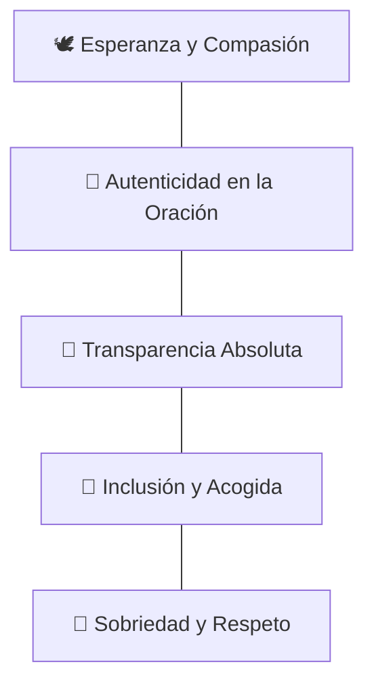

# 🕊️ 01. Misión, Visión y Valores de Cielo Santo

> [!NOTE]
> **Cielo Santo** no es simplemente una página web; es un púlpito y santuario digital concebido para acercar la paz de Dios a personas que enfrentan la soledad, la angustia, la enfermedad o la pérdida de esperanza en el mundo contemporáneo.

---

## 1. La Declaración de Misión

> *"Ofrecer un refugio digital de serenidad, oración continua y consuelo espiritual, conectando a creyentes y personas necesitadas de esperanza a través de la sabiduría bíblica, el poder sanador de los Salmos y la solidaridad comunitaria."*

En un entorno digital saturado de noticias desalentadoras, ruido y polarización, **Cielo Santo** actúa como un remanso de calma donde cualquier ser humano puede encontrar una palabra de aliento, un oído empático que ore por él y herramientas prácticas para cultivar su vida espiritual diaria.

---

## 2. La Visión a 3 Años

> *"Convertirnos en la comunidad de oración e intercesión digital en español más cálida, transparente e impactante de América Latina y el mundo hispanohablante, sosteniendo a cientos de miles de familias en oración y canalizando ayuda humanitaria directa a comedores y causas benéficas."*

### Hitos de la Visión:
1. **Comunidad Activa**: Superar los 50.000 miembros que reciben devocionales matutinos y participan en el muro de oración cada día.
2. **Sinergia Audiovisual**: Construir un ecosistema armónico donde los videos y Shorts de [**@cielosanto20**](https://youtube.com/@cielosanto20) y la plataforma web se nutran mutuamente en tiempo real.
3. **Brazo Solidario**: Respaldar activamente a fundaciones aliadas de alimentación y abrigo infantil mediante la transparencia absoluta de las ofrendas comunitarias.

---

## 3. Los 5 Valores No Negociables

### 1. Esperanza y Compasión
Cada interacción (un mensaje, una oración, un versículo o un correo) debe transmitir calidez incondicional. No juzgamos la situación de quien llega; lo acogemos como un hermano.

### 2. Autenticidad en la Oración
La oración no es una transacción comercial. Cuando oramos por las intenciones del muro, lo hacemos con fe genuina e intercesión sincera en los videos y en la devoción diaria.

### 3. Transparencia y Rendición de Cuentas
Las ofrendas y compras de material tienen destinos claros: sostener los costos de producción y mantenimiento del ministerio y apoyar a familias vulnerables con alimentos ("Pan y Abrigo"). Cada aporte se respeta con máxima integridad.

### 4. Inclusión y Acogida Espiritual
Cualquier persona que busque a Dios, sin importar su trasfondo eclesiástico previo, es bienvenida a orar, leer los Salmos y dejar sus peticiones.

### 5. Sobriedad y Cuidado Estético
Rechazamos el sensacionalismo o el marketing agresivo y manipulador. Nuestra estética es limpia, serena, sobria y profundamente digna.

---

## 4. Conexiones en la Bóveda
- [[02_Audiencia_y_Buyer_Personas]]: A quién nos dirigimos y qué batallas espirituales libran.
- [[03_Identidad_Visual_y_Tono_de_Voz]]: Cómo se traduce esta visión en diseño y palabras.
- [[02_Sistema_de_Donaciones_y_Siembra]]: Cómo se materializa la obra social y solidaria.
