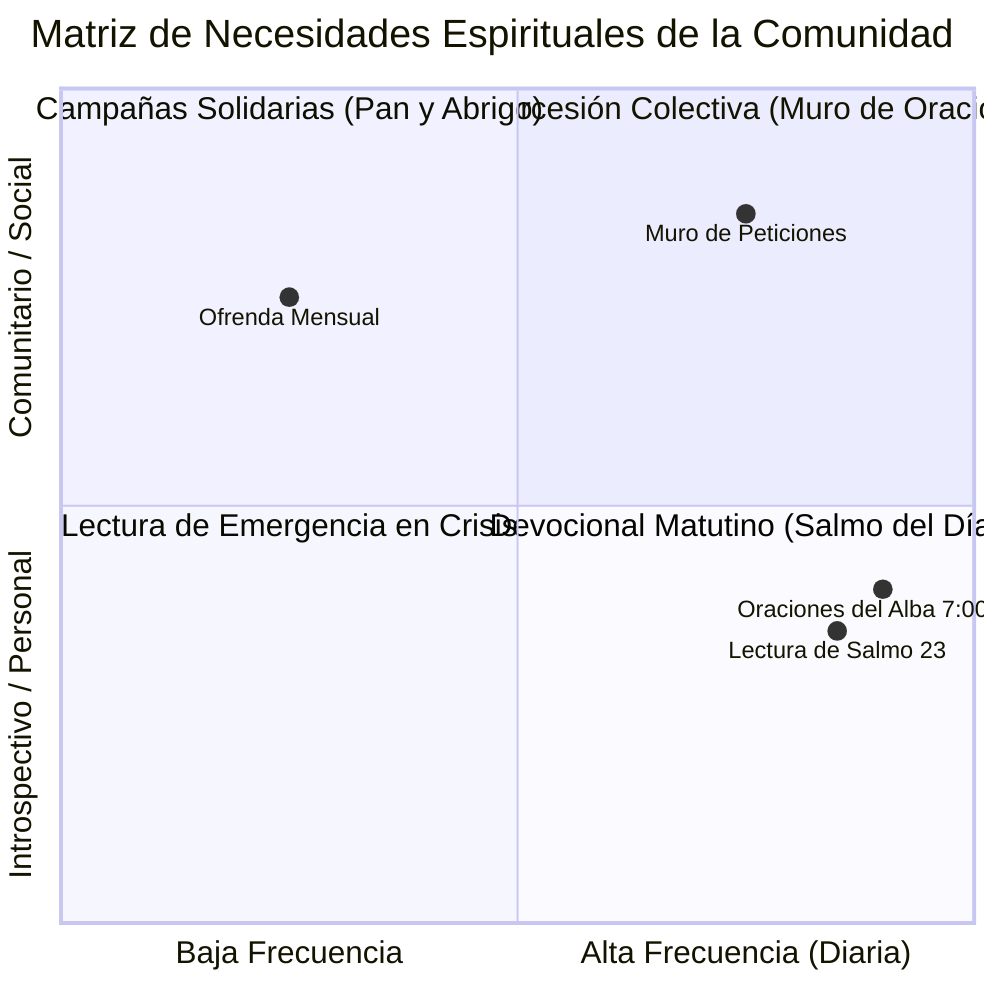

# 👥 02. Audiencia Objetivo y Buyer Personas

> [!NOTE]
> La audiencia de **Cielo Santo** posee una altísima sensibilidad emocional y espiritual. No buscan productos técnicos, sino consuelo, certeza, compañía divina y la sensación reconfortante de que *"no están solos en su desierto"*.

---

## 1. Datos Demográficos y Geográficos Generales

- **Edades Predominantes**: 25 a 65+ años (fuerte presencia de 35-60 años, especialmente en interacción y donaciones).
- **Género**: 65% Mujeres, 35% Hombres (distribución típica de comunidades devocionales y de intercesión en YouTube/Facebook).
- **Geografía Clave**:
  - **Chile**: Mercado inicial (foco actual del catálogo con precios en CLP).
  - **Hispanoamérica y USA Hispano**: México, Colombia, Perú, Argentina, Guatemala y comunidades hispanohablantes en Estados Unidos (foco del canal de YouTube y donaciones en USD).
- **Canales de Contacto**: YouTube Shorts / Videos matutinos, WhatsApp familiar, Facebook y correo electrónico.
- **Dispositivo Principal**: Teléfono móvil (88% del tráfico total). Es vital que la interfaz móvil sea perfecta.

---

## 2. Arquetipos de Usuario (Buyer Personas)

### Arquetipo A: "María Elena" — La Madre Intercesora y Pilar Familiar

| Atributo | Detalle |
| :--- | :--- |
| **Edad y Rol** | 54 años, madre de 3 hijos, trabajadora de hogar o comercio local. |
| **Ubicación** | Santiago / Regiones (Chile) o Conurbano Latinoamericano. |
| **Estado Emocional** | Preocupada por la salud de familiares, la economía del hogar y el futuro de sus hijos. |
| **Comportamiento Digital** | Muy activa en WhatsApp (manda bendiciones matutinas en grupos de familia), ve YouTube en la cocina o al despertar. |
| **Punto de Dolor** | Siente sobrecarga emocional y necesita sentir el apoyo de una comunidad que la respalde en oración. |
| **Acción Clave en la Web** | Escribe en el [[02_Componentes_e_Interactividad#3-muro-de-intenciones\|Muro de Intenciones]], pulsa "Decir Amén" y comparte el Salmo por WhatsApp. |
| **Oferta Ideal** | *Devocional: 30 Días (PDF)* ($4.990 CLP) y ofrenda *Semilla de Fe* ($5 USD). |

---

### Arquetipo B: "Carlos Andrés" — El Joven en Búsqueda de Paz y Dirección

| Atributo | Detalle |
| :--- | :--- |
| **Edad y Rol** | 32 años, técnico / oficinista, soltero o recién casado. |
| **Ubicación** | Ciudad urbana, ritmo acelerado. |
| **Estado Emocional** | Agotamiento mental, ansiedad laboral, sensación de vacío o distanciamiento espiritual. |
| **Comportamiento Digital** | Desliza YouTube Shorts de noche cuando no puede dormir o al despertar a las 6:30 AM. |
| **Punto de Dolor** | No tiene tiempo para lecturas bíblicas largas; necesita cápsulas de sabiduría de 3 a 5 minutos que le devuelvan el centro. |
| **Acción Clave en la Web** | Descubre la web desde un enlace en la descripción de un Short de YouTube. |
| **Oferta Ideal** | Suscripción mensual *Oraciones del Alba* ($2.990 CLP/mes) para recibir el correo diario de las 7:00 AM. |

---

### Arquetipo C: "Roberto C." — El Sembrador y Benefactor Fiel

| Atributo | Detalle |
| :--- | :--- |
| **Edad y Rol** | 62 años, jubilado o comerciante consolidado, abuelo. |
| **Ubicación** | Chile o Estados Unidos (hispano de segunda generación). |
| **Estado Emocional** | Profunda gratitud a Dios por haber superado momentos difíciles en el pasado (depresión, quiebras o enfermedades). |
| **Comportamiento Digital** | Fiel consumidor de videos largos de oración; lee con atención páginas de testimonio. |
| **Punto de Dolor** | Desconfía de iglesias o instituciones poco transparentes que lucran sin rendir cuentas. |
| **Acción Clave en la Web** | Revisa la sección "La obra en acción" (Pan y Abrigo) en `/donaciones`. |
| **Oferta Ideal** | *Pilar del Ministerio* ($30 USD mensuales) o aportes directos a la campaña *Sembrando Esperanza*. |

---

## 3. Matriz de Empatía: Lo que la Audiencia Piensa, Siente y Necesita

---

## 4. Conclusiones Estratégicas para el Producto Web
1. **Velocidad y Cero Fricción**: Un usuario en angustia no tolerará registros complejos ni formularios engorrosos. Publicar una oración debe tomar menos de 15 segundos.
2. **Botón de WhatsApp Prominente**: El canal WhatsApp es la arteria de mayor viralidad orgánica para este perfil demográfico.
3. **Clara Evidencia de Fe y Honestidad**: Los sellos de seguridad bancaria, testimonios reales y fotos de la obra social son cruciales para convertir intenciones en donaciones sostenibles.
