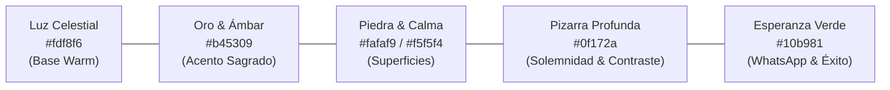

# 🎨 03. Identidad Visual y Tono de Voz

> [!NOTE]
> La experiencia sensorial de **Cielo Santo** busca evocar la atmósfera de un templo al amanecer: serenidad, luz tenue, calidez de madera y piedra, y palabras que apaciguan el alma.

---

## 1. Sistema Cromático (Tokens de Tailwind v4)

La paleta equilibra tonos lumínicos dorados con bases de piedra natural y fondos oscuros de alta solemnidad:



### Tabla de Colores y Usos

| Color / Token | Hexadecimal | Propósito en la Interfaz | Ejemplo en Código |
| :--- | :--- | :--- | :--- |
| **Warm Canvas** | `#fdf8f6` | Fondo general del `body` en `globals.css` | `body { background-color: #fdf8f6; }` |
| **Amber 700** | `#b45309` | Botones de acción principales, enlaces y marca | `bg-amber-700 hover:bg-amber-800 text-white` |
| **Amber 500/20** | `rgba(245,158,11,0.2)` | Chips luminosos y brillos ambientales | `bg-amber-500/20 text-amber-200 border-amber-400/30` |
| **Slate 900** | `#0f172a` | Fondos solemnes (Hero, footer, tarjetas clave) | `bg-slate-900 text-white` |
| **Stone 50 / 100** | `#fafaf9 / #f5f5f4` | Fondos de tarjetas de oración y muros | `bg-stone-50 border-stone-200` |
| **Emerald 600** | `#059669` | Botón de compartir en WhatsApp | `bg-emerald-600 hover:bg-emerald-700` |

---

## 2. Tipografía y Jerarquía Visual

La combinación tipográfica juega un rol esencial en la transmisión de dignidad y paz:

### A. Tipografía Serif (`font-serif`)
- **Uso**: Títulos principales (`h1`, `h2`, `h3`), citas bíblicas, Salmo del Día y encabezados de testimonios.
- **Sensación**: Reverencia, tradición bíblica, peso editorial y serenidad.
- **Clases**: `font-serif text-4xl sm:text-5xl md:text-6xl font-bold leading-tight drop-shadow-lg`.

### B. Tipografía Sans-Serif (`font-sans`)
- **Uso**: Textos de párrafos, etiquetas secundarias, botones, inputs de formularios y navegación.
- **Sensación**: Modernidad, limpieza, legibilidad cristalina en pantallas de teléfonos móviles.
- **Clases**: `text-slate-600 text-sm md:text-base leading-relaxed`.

---

## 3. Tono de Voz y Guía de Redacción Pastoral

El lenguaje de Cielo Santo debe mantenerse en un equilibrio delicado:

```
            [ CÁLIDO & EMPÁTICO ]
                      │
   [ ESPIRITUAL ] ────┼──── [ CERCANO & HUMANO ]
                      │
           [ NUNCA MANIPULADOR ]
```

### Principios Fundamentales:

1. **Voz Pastoral y Fraterna**:
   - Hablamos como un hermano en la fe que camina al lado del creyente, no como un juez ni como un vendedor agresivo.
   - *Ejemplo correcto*: *"Deja tu intención aquí para que oremos por ti."*
   - *Evitar*: *"¡Aprovecha hoy mismo nuestra oferta especial de oración!"*

2. **Validación del Dolor Humano**:
   - Reconocemos la dificultad sin dramatizar con morbo ni caer en positivismo superficial.
   - *Ejemplo correcto*: *"En momentos de desierto o enfermedad, una palabra a tiempo renueva las fuerzas."*
   - *Evitar*: *"Si no tienes fe suficiente, tus problemas continuarán."*

3. **Claridad y Dignidad Financiera**:
   - Las ofrendas se presentan como una "siembra" y un acto voluntario de amor y sostén solidario, con total transparencia respecto al destino social de los fondos.
   - *Ejemplo correcto*: *"Tu ofrenda sostiene la producción diaria y nos permite llevar cajas de alimentos a familias necesitadas."*
   - *Evitar*: *"Paga tu cuota para recibir la bendición garantizada."*

---

## 4. Guía de Iconografía y Fotografía

- **Fotografía Permitida**:
  - Amaneceres naturales, montañas envueltas en luz matutina, senderos despejados.
  - Rostros serenos, manos abiertas o unidas en plegaria silenciosa.
  - Obras de ayuda real: entrega de alimentos calientes, despensas y abrigo.
- **Fotografía Prohibida**:
  - Imágenes trilladas de stock con poses artificiales o actores sobreactuados.
  - Simbología esotérica, luces artificiales violetas estridentes o gráficos kitsch.
- **Iconografía**:
  - Trazos delgados (`strokeWidth="1.5"` o `strokeWidth="2"`), estilos minimalistas tipo Heroicons o Lucide (cruces sutiles, manos, corazones, palomas, sol, libros).
