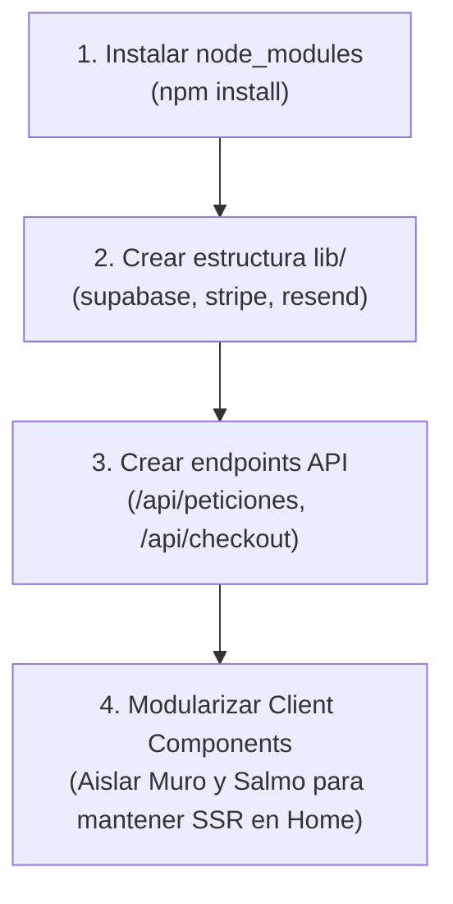

# 💻 01. Auditoría Técnica del Codebase

> [!NOTE]
> Esta auditoría examina la base de código del proyecto **`cielo-santo-web`**, analizando la salud arquitectónica, las dependencias instaladas, el sistema de tipos y las brechas existentes entre la interfaz actual y la infraestructura esperada.

---

## 1. Ficha Técnica de Tecnologías

| Componente | Versión Declarada | Estado | Observación |
| :--- | :--- | :---: | :--- |
| **Framework Base** | Next.js `16.3.6` | 🟢 Moderno | Versión de vanguardia con App Router nativo. |
| **Librería UI** | React `19.2.8` | 🟢 Moderno | Soporte para Server Actions y React Server Components. |
| **Motor de Estilos**| Tailwind CSS `4.0` | 🟢 Moderno | Configurado mediante `@tailwindcss/postcss` y `@import "tailwindcss";`. |
| **Base de Datos** | `@supabase/supabase-js` `^2.117.1` | 🟡 Parcial | Dependencia presente en `package.json`; **sin cliente `lib/supabase.ts` ni tablas creadas**. |
| **Pasarela de Pagos**| `stripe` `^22.6.2` | 🟡 Parcial | Dependencia presente en `package.json`; **sin endpoints `/api/checkout` ni webhooks**. |
| **Motor de Correo** | `resend` `^6.28.1` | 🟡 Parcial | Dependencia presente en `package.json`; **sin plantillas ni lógica de despacho**. |
| **Tipado** | TypeScript `^5` | 🟢 Activo | Configurado en `tsconfig.json` con paths `@/*`. |

---

## 2. Radiografía del Árbol de Archivos

```
cielo-santo-web/
├── app/
│   ├── layout.tsx             # RootLayout: Navbar sticky, metadata base y footer
│   ├── globals.css            # Importación Tailwind v4 y estilos de body
│   ├── page.tsx               # Home ("use client"): Hero, Salmo, Donación Banner, Muro, YouTube
│   ├── donaciones/
│   │   └── page.tsx           # Landing de ofrendas con tiers ($5, $15, $30 USD)
│   └── productos/
│       └── page.tsx           # Catálogo con suscripción mensual ($2.990) y devocional PDF ($4.990)
├── components/
│   └── CampanaDonacion.tsx    # Banner reusable para la campaña "Sembrando Esperanza"
├── CieloSanto_boveda/         # Bóveda viva de conocimiento en Obsidian
├── eslint.config.mjs          # Configuración ESLint con core-web-vitals
├── next.config.ts             # Configuración Next.js (vacía actualmente)
├── package.json               # Manifiesto de paquetes y scripts
├── package-lock.json          # Bloqueo de dependencias
└── tsconfig.json              # Configuración TypeScript
```

---

## 3. Hallazgos Técnicos Críticos

### A. Estado de `node_modules` y Dependencias Locales
- Al ejecutar `npm run lint`, el proceso arroja error de módulo no encontrado (`Cannot find package 'eslint-config-next'`).
- **Causa**: El directorio `node_modules` no está presente en el entorno local actual.
- **Acción requerida**: Ejecutar `npm install` o `npm ci` para instalar todas las dependencias bloqueadas en `package-lock.json`.

### B. Huérfanos de Integración (Supabase, Stripe, Resend)
- `package.json` ya incluye los SDKs más potentes del ecosistema web moderno (`@supabase/supabase-js`, `stripe`, `resend`).
- Sin embargo:
  1. No existe un directorio `lib/` para inicializar los clientes (`lib/supabase.ts`, `lib/stripe.ts`, `lib/resend.ts`).
  2. No existen variables de entorno definidas (`.env.local` o `.env.example`).
  3. No existen rutas de API en `app/api/` para recibir callbacks, procesar webhooks o interactuar con la base de datos de manera segura.

### C. Manejo de Estado en `app/page.tsx`
- Actualmente, `app/page.tsx` tiene la directiva `"use client"` en la raíz de toda la página para manejar dos estados:
  ```typescript
  const [amenCount, setAmenCount] = useState(142);
  const [hasClickedAmen, setHasClickedAmen] = useState(false);
  const [peticiones, setPeticiones] = useState([...]);
  ```
- **Consecuencias**:
  1. Toda la página principal se ejecuta en el cliente, perdiendo los beneficios de SEO y Server-Side Rendering (SSR) de Next.js para los títulos y textos bíblicos.
  2. Al recargar la página (`F5`), cualquier interacción se resetea inmediatamente a los valores hardcoded iniciales.
  3. El formulario de peticiones ejecuta `e.preventDefault()`, pero no tiene código para insertar la nueva petición ni en el array local ni en una base de datos externa.

---

## 4. Matriz de Deuda Técnica y Recomendaciones



| Nivel de Riesgo | Problema Detectado | Solución Recomendada |
| :---: | :--- | :--- |
| 🔴 **Alto** | Formulario de peticiones inerte (no guarda nada) | Crear tabla `peticiones` en Supabase y conectar `fetch('/api/peticiones')`. |
| 🔴 **Alto** | Botones de compra y ofrenda sin pasarela | Conectar Stripe Checkout Sessions con IDs de precio en variables de entorno. |
| 🟡 **Medio** | Toda la Home es Client Component | Extraer `MuroOracion.tsx` y `SalmoInteractivo.tsx` como componentes cliente aislados. |
| 🟡 **Medio** | Falta de `.env.example` documentado | Añadir plantilla con claves públicas y secretas para desarrollo y producción. |
| 🟢 **Bajo** | Falta configuración de imágenes externas | Añadir dominios de Unsplash en `next.config.ts` para habilitar `next/image`. |
