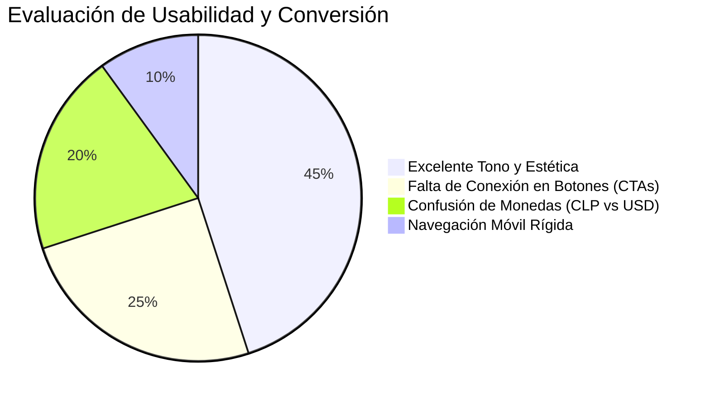

# 🎯 02. Auditoría de UX, UI y Conversión

> [!NOTE]
> La experiencia de usuario en un portal devocional exige un cuidado ético y emocional extremo: el visitante a menudo llega en un estado de vulnerabilidad o necesidad espiritual. Cada obstáculo, botón roto o inconsistencia visual daña la confianza construida por el canal de YouTube.

---

## 1. Evaluación Heurística de la Interfaz

---

## 2. Los 5 Hallazgos Críticos de Conversión

### 1. El Formulario de Peticiones Inerte (Riesgo Emocional Crítico)
- **Ubicación**: `app/page.tsx` (Muro de Intenciones).
- **Problema**: Un usuario escribe una petición íntima (salud de su madre, paz familiar, etc.), presiona *"Publicar Petición"* y... **nada ocurre**. La página no muestra mensaje de éxito, no añade la petición a la lista y no da confirmación.
- **Impacto**: Frustración y sensación de desamparo espiritual.
- **Solución Urgente**:
  1. Conectar el formulario a la tabla `peticiones` de Supabase.
  2. Añadir un estado de carga (`"Enviando tu petición..."`) y un mensaje de agradecimiento: *"Tu petición ha sido recibida. Estaremos orando por ti"*.
  3. Insertar la nueva petición arriba en la lista con una animación suave de entrada.

### 2. Discrepancia Monetaria: Pesos Chilenos (CLP) vs Dólares (USD)
- **Ubicación**:
  - En `/productos`: Suscripción a **$2.990 CLP** y Devocional a **$4.990 CLP**.
  - En `/donaciones`: Ofrendas de **$5 USD**, **$15 USD** y **$30 USD**.
- **Problema**:
  - Para un visitante de México, Colombia o EE.UU., ver `$4.990` en el catálogo puede alarmarlo al pensar que son 4.990 dólares.
  - Para un usuario chileno, pasar de ver pesos en el catálogo a ver dólares en donaciones genera fricción cognitiva y dudas sobre cómo se procesará el cobro.
- **Solución Propuesta**:
  - Consulta la nota estratégica [[03_Estrategia_Multidivisa_CLP_USD]]: implementar selector visual de divisa o unificar la pasarela de Stripe con multidivisa automática según el país de la IP.

### 3. Botones de Conversión Desconectados (Dead CTAs)
- **Ubicación**:
  - Botón *"Suscribirme Ahora"* (`/productos`, L56).
  - Botón *"Comprar y Descargar"* (`/productos`, L94).
  - Tres botones *"Ofrendar Ahora"* (`/donaciones`, L110, L124, L135).
- **Problema**: Son elementos `<button>` sin atributos `onClick` ni enlaces `<a>` o `<Link>`. El usuario con intención de compra o donación se queda estancado.
- **Solución**: Enlazar a un endpoint `/api/checkout` que redirija a Stripe Checkout con el `priceId` correspondiente.

### 4. Barra de Navegación y Responsive Móvil
- **Ubicación**: `app/layout.tsx`.
- **Problema**:
  - Tanto `/productos` como `/donaciones` tienen la clase activa `text-amber-700` fija simultáneamente.
  - En pantallas pequeñas (smartphones estrechos), los enlaces pueden apiñarse o desbordarse por la falta de un menú hamburguesa desplegable.
- **Solución**: Resaltar únicamente la ruta activa mediante `usePathname()` de Next.js y añadir un menú móvil desplegable para pantallas menores a 640px.

### 5. Reproductor de Video Simulado en `/donaciones`
- **Ubicación**: `app/donaciones/page.tsx` (Sección 2, L30-52).
- **Problema**: Muestra una miniatura con un botón de Play gigante ("Mira el impacto de tu siembra — 3:15"), pero al hacer clic no se reproduce ningún video.
- **Solución**: Reemplazar por un iframe de YouTube responsivo con un video real del ministerio o un modal interactivo con el video oficial.

---

## 3. Elementos Sobresalientes (Fortalezas a Mantener)

| Elemento | Ubicación | Por qué funciona excepcionalmente bien |
| :--- | :--- | :--- |
| **Botón "Compartir en WhatsApp"** | `app/page.tsx` | Redacta automáticamente el Salmo con cita bíblica y firma de Cielo Santo. Excelente motor de viralidad familiar. |
| **Tarjeta "Luz de Esperanza"** | `app/donaciones/page.tsx` | El badge *"MAYOR IMPACTO"* y el sutil escalado visual (`scale-105`) aplican las mejores prácticas de psicología de precios. |
| **Sección "La obra en acción"** | `app/donaciones/page.tsx` | Humaniza la donación dividiéndola en *Pan y Abrigo* (alimento físico) y *Luz y Palabra* (esperanza digital). Genera alta credibilidad. |
| **Preguntas Frecuentes (FAQ)** | `app/productos/page.tsx` | Responde con precisión las tres objeciones típicas: entrega inmediata, seguridad bancaria y facilidad de cancelación. |

---

## 4. Conclusiones y Próximos Pasos
- La base estética y emocional es de primera categoría; el proyecto no necesita un rediseño visual, sino **dar vida a sus puntos de contacto interactivos**.
- Prioridad inmediata: conectar el Muro de Oración y los botones de Stripe para no perder las conversiones que lleguen desde YouTube.
