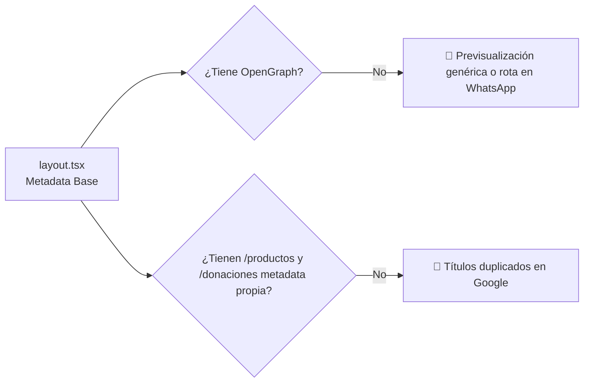

# 🚀 03. Auditoría de SEO y Rendimiento

> [!NOTE]
> Para una plataforma que aspira a ser compartida masivamente en WhatsApp y posicionar oraciones diarias en Google, las etiquetas de previsualización (OpenGraph) y la velocidad de carga en dispositivos móviles con redes 4G son determinantes.

---

## 1. Estado Actual de Metadatos y SEO



### Tabla de Auditoría de Metadatos

| Parámetro SEO | Implementado | Estado | Impacto / Acción |
| :--- | :---: | :---: | :--- |
| **Title Global** | Sí | 🟢 Correcto | `"Cielo Santo \| Oración y Fe"` |
| **Description Global** | Sí | 🟢 Correcto | `"Un espacio de fe, oración y esperanza."` |
| **OpenGraph (`og:image`)** | No | 🔴 Crítico | Al compartir en WhatsApp, no se muestra una imagen atractiva de Cielo Santo. |
| **Twitter Card** | No | 🟡 Medio | Faltan tarjetas `summary_large_image`. |
| **Canonical URL** | No | 🟡 Medio | Previene contenido duplicado en buscadores. |
| **Metadata por Ruta** | No | 🔴 Crítico | `/productos` y `/donaciones` carecen de `export const metadata`. |
| **Datos Estructurados (JSON-LD)**| No | 🟡 Oportunidad| No hay schema `Organization` o `WebSite` para fragmentos enriquecidos en Google. |

---

## 2. Auditoría de Imágenes y Core Web Vitals (CWV)

### A. Uso de Etiquetas `` Estándar vs `next/image`
Actualmente, todas las imágenes de Unsplash se cargan usando etiquetas HTML ``:
- `https://images.unsplash.com/photo-1464822759023-fed622ff2c3b?q=80&w=2070` (Hero, Home)
- `https://images.unsplash.com/photo-1443527216320-7e744084f5a7?q=80&w=2070` (Header Donaciones)
- `https://images.unsplash.com/photo-1488521787991-ed7bbaae773c?q=80&w=2070` (Galería Donaciones)

#### Problemas de Rendimiento:
1. **Sobrecarga de Datos**: Las imágenes se descargan a 2070 píxeles de ancho incluso en teléfonos de 390px, gastando megabytes del plan de datos del usuario.
2. **Impacto en LCP (Largest Contentful Paint)**: El Hero tarda más en desplegarse completamente, afectando la métrica clave de Google.
3. **Falta de soporte WebP/AVIF automático**: `next/image` comprime automáticamente a formatos de última generación; el `` nativo no lo hace.

#### Solución Técnica:
1. Configurar `next.config.ts` permitiendo el dominio de imágenes:
```typescript
import type { NextConfig } from "next";

const nextConfig: NextConfig = {
  images: {
    remotePatterns: [
      {
        protocol: 'https',
        hostname: 'images.unsplash.com',
      },
    ],
  },
};

export default nextConfig;
```
2. Reemplazar `` por `import Image from 'next/image'` con `priority` en el Hero.

---

## 3. Plan de Optimización de Metadatos Propuesto

### Plantilla de Metadatos para `app/layout.tsx`:
```typescript
export const metadata: Metadata = {
  metadataBase: new URL("https://cielosanto.com"), // Ajustar al dominio real
  title: {
    default: "Cielo Santo | Un refugio de paz para tu espíritu",
    template: "%s | Cielo Santo",
  },
  description: "Unimos corazones a través de la oración diaria, los Salmos de consuelo y el apoyo mutuo. Deja tu intención y acompáñanos en fe.",
  openGraph: {
    title: "Cielo Santo | Oración y Refugio Espiritual",
    description: "Únete a nuestra comunidad de fe. Deja tu petición en el muro de oración y descubre devocionales diarios.",
    url: "https://cielosanto.com",
    siteName: "Cielo Santo",
    images: [
      {
        url: "/og-image.jpg", // Banner optimizado de 1200x630px
        width: 1200,
        height: 630,
        alt: "Cielo Santo - Comunidad de Oración y Fe",
      },
    ],
    locale: "es_LA",
    type: "website",
  },
  twitter: {
    card: "summary_large_image",
    title: "Cielo Santo | Oración y Fe",
    description: "Un espacio de fe, oración y esperanza.",
  },
};
```

---

## 4. Conclusión de la Auditoría
Implementar `next/image` y configurar el paquete completo de metadatos OpenGraph transformará el rendimiento técnico de la web, garantizando que cuando un usuario comparta el Salmo 23 por WhatsApp, el enlace se visualice con una tarjeta impecable y profesional.
