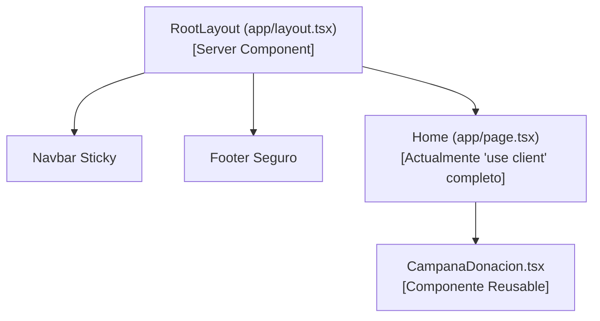
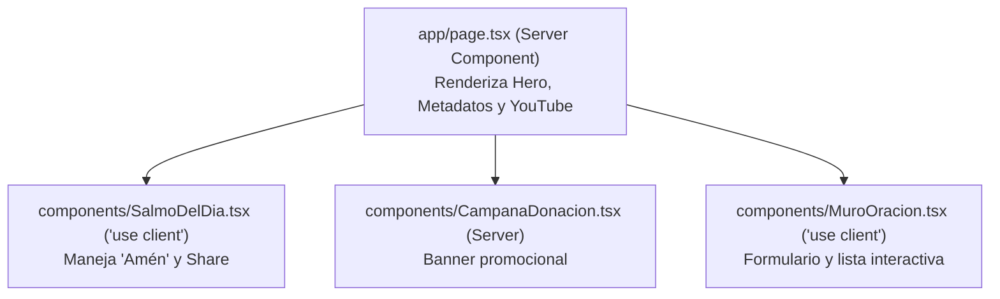

# 🧩 02. Componentes e Interactividad

> [!NOTE]
> Este documento detalla la estructura, estado y ciclo de vida de los componentes visuales de **Cielo Santo**, así como la estrategia de refactorización recomendada para separar *Server Components* de *Client Components*.

---

## 1. Catálogo de Componentes Actuales



### A. `CampanaDonacion.tsx`
- **Ubicación**: `components/CampanaDonacion.tsx`.
- **Naturaleza**: Server Component puro (sin estado propio).
- **Diseño**:
  - Fondo `bg-slate-900` con tarjeta redondeada (`rounded-3xl`) y sombra profunda.
  - Efecto de luz ambiental con `bg-amber-500/10 blur-[80px]`.
  - Icono SVG de sol radiante en contenedor circular oscuro.
  - Botón de enlace hacia `/donaciones` con texto *"Conoce cómo apoyar"*.
- **Propósito**: Actúa como un puente de concienciación en la Home para invitar a la congregación a sostener la campaña mensual *"Sembrando Esperanza"*.

### B. Salmo del Día Interactivo
- **Ubicación**: Sección 2 de `app/page.tsx`.
- **Elementos**:
  - Cita bíblica (Salmo 23:1-2) en tipografía serif itálica de gran tamaño.
  - Botón **"Decir Amén"**: Al hacer clic, incrementa el contador y cambia su estado a *"¡Amén registrado!"* bloqueando clics repetidos.
  - Botón **"Compartir en WhatsApp"**: Abre la API de WhatsApp preconfigurando el mensaje:
    ```javascript
    `https://api.whatsapp.com/send?text=${encodeURIComponent('"El Señor es mi pastor; nada me faltará..." - Salmo 23:1-2. Compartido desde Cielo Santo.')}`
    ```

### C. Muro de Intenciones
- **Ubicación**: Sección 3 de `app/page.tsx`.
- **Estructura**:
  1. *Formulario de entrada*: Input de texto para nombre e input `textarea` para la petición.
  2. *Lista de peticiones de la comunidad*: Renderiza tarjetas individuales con nombre, texto y botón de apoyo (*"Unirme en Oración"*).

---

## 2. Plan de Refactorización: Aislamiento de "use client"

Actualmente, todo `app/page.tsx` está marcado con `"use client"`. Esto obliga al navegador a descargar e hidratar JavaScript para secciones que son completamente estáticas (como el Hero y la sección de YouTube).

### Arquitectura Modular Propuesta:



### Ventajas de la Refactorización:
1. **SEO Superior**: Google indexa directamente el texto del Hero y las oraciones pre-renderizadas en el servidor.
2. **First Contentful Paint (FCP) Instantáneo**: La página se muestra de inmediato sin esperar la descarga de bundles de JavaScript.
3. **Mantenibilidad**: El código del Muro de Peticiones y del Salmo queda encapsulado en componentes dedicados y testeables.
