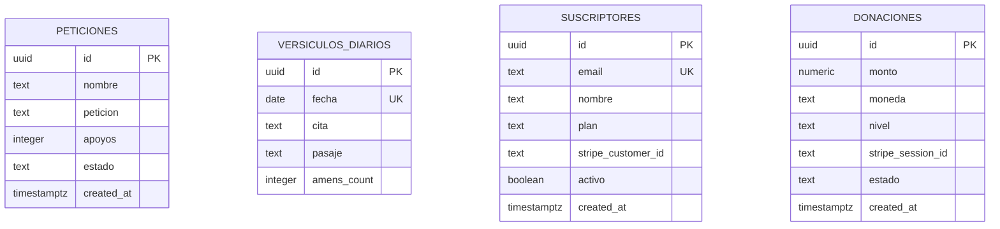

# 🗄️ 03. Integración de Supabase y Base de Datos

> [!NOTE]
> La dependencia `@supabase/supabase-js` ya se encuentra instalada en `package.json`. Este documento establece el diseño relacional del modelo de datos, las políticas de seguridad (RLS) y el código de conexión para convertir el Muro de Peticiones y las métricas en un sistema persistente en tiempo real.

---

## 1. Esquema SQL Relacional Propuesto



### Script de Creación de Tablas (DDL)

```sql
-- 1. Tabla de Peticiones de Oración
CREATE TABLE public.peticiones (
    id UUID PRIMARY KEY DEFAULT gen_random_uuid(),
    nombre TEXT NOT NULL,
    peticion TEXT NOT NULL,
    apoyos INTEGER NOT NULL DEFAULT 0,
    estado TEXT NOT NULL DEFAULT 'aprobado' CHECK (estado IN ('aprobado', 'pendiente', 'moderado')),
    created_at TIMESTAMPTZ NOT NULL DEFAULT NOW()
);

-- Índice para acelerar la carga de las oraciones más recientes
CREATE INDEX idx_peticiones_created_at ON public.peticiones(created_at DESC);

-- 2. Tabla de Versículos Diarios y Contador de Amén
CREATE TABLE public.versiculos_diarios (
    id UUID PRIMARY KEY DEFAULT gen_random_uuid(),
    fecha DATE NOT NULL UNIQUE DEFAULT CURRENT_DATE,
    cita TEXT NOT NULL,
    pasaje TEXT NOT NULL,
    amens_count INTEGER NOT NULL DEFAULT 0
);

-- 3. Tabla de Suscriptores (Oraciones del Alba 7:00 AM)
CREATE TABLE public.suscriptores (
    id UUID PRIMARY KEY DEFAULT gen_random_uuid(),
    email TEXT NOT NULL UNIQUE,
    nombre TEXT,
    plan TEXT NOT NULL DEFAULT 'oraciones_del_alba',
    stripe_customer_id TEXT,
    activo BOOLEAN NOT NULL DEFAULT TRUE,
    created_at TIMESTAMPTZ NOT NULL DEFAULT NOW()
);

-- 4. Registro Histórico de Donaciones y Siembra
CREATE TABLE public.donaciones (
    id UUID PRIMARY KEY DEFAULT gen_random_uuid(),
    monto NUMERIC(10, 2) NOT NULL,
    moneda TEXT NOT NULL DEFAULT 'usd',
    nivel TEXT NOT NULL, -- 'semilla', 'luz', 'pilar', 'libre'
    stripe_session_id TEXT UNIQUE,
    estado TEXT NOT NULL DEFAULT 'completado',
    created_at TIMESTAMPTZ NOT NULL DEFAULT NOW()
);
```

---

## 2. Función RPC para Incremento Atómico de Apoyos

Para evitar condiciones de carrera cuando múltiples usuarios hacen clic simultáneamente en *"Unirme en Oración"*:

```sql
CREATE OR REPLACE FUNCTION public.incrementar_apoyo(peticion_id UUID)
RETURNS INTEGER AS $$
DECLARE
    nuevo_total INTEGER;
BEGIN
    UPDATE public.peticiones
    SET apoyos = apoyos + 1
    WHERE id = peticion_id
    RETURNING apoyos INTO nuevo_total;
    
    RETURN nuevo_total;
END;
$$ LANGUAGE plpgsql SECURITY DEFINER;
```

---

## 3. Políticas de Seguridad a Nivel de Fila (RLS)

```sql
-- Habilitar RLS en la tabla peticiones
ALTER TABLE public.peticiones ENABLE ROW LEVEL SECURITY;

-- Permitir lectura pública de peticiones aprobadas
CREATE POLICY "Lectura pública de oraciones aprobadas"
ON public.peticiones FOR SELECT
USING (estado = 'aprobado');

-- Permitir a cualquier visitante publicar una petición
CREATE POLICY "Inserción pública de oraciones"
ON public.peticiones FOR INSERT
WITH CHECK (true);
```

---

## 4. Cliente Singleton en TypeScript (`lib/supabase.ts`)

```typescript
// lib/supabase.ts
import { createClient } from '@supabase/supabase-js';

const supabaseUrl = process.env.NEXT_PUBLIC_SUPABASE_URL || '';
const supabaseAnonKey = process.env.NEXT_PUBLIC_SUPABASE_ANON_KEY || '';

export const supabase = createClient(supabaseUrl, supabaseAnonKey);
```

---

## 5. Implementación de Tiempo Real (Realtime)

Gracias al motor de WebSockets de Supabase, el Muro de Intenciones puede escuchar nuevas peticiones en vivo sin necesidad de que el usuario recargue el navegador:

```typescript
useEffect(() => {
  const channel = supabase
    .channel('peticiones-en-vivo')
    .on(
      'postgres_changes',
      { event: 'INSERT', schema: 'public', table: 'peticiones' },
      (payload) => {
        setPeticiones((prev) => [payload.new, ...prev]);
      }
    )
    .subscribe();

  return () => {
    supabase.removeChannel(channel);
  };
}, []);
```
