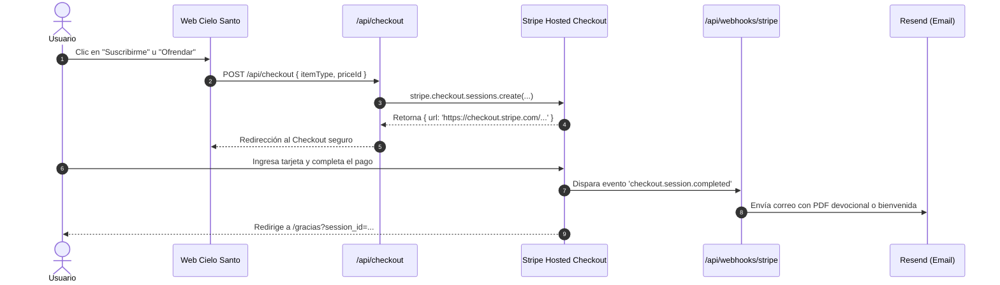

# 💳 04. Integración de Stripe y Pasarela de Pagos

> [!NOTE]
> El SDK oficial de Stripe (`stripe: ^22.6.2`) ya está instalado en el proyecto. Esta nota define la arquitectura de integración para cobros únicos (Devocional PDF), suscripciones mensuales (*Oraciones del Alba*) y donaciones solidarias.

---

## 1. Arquitectura del Flujo de Pago



---

## 2. Tipos de Transacciones Soportadas

| Producto / Causa | Modelo Stripe | Moneda Actual | Redirección Exitosa | Cumplimiento (Fulfillment) |
| :--- | :--- | :---: | :--- | :--- |
| **Oraciones del Alba** | `mode: 'subscription'` | CLP / USD | `/gracias?plan=alba` | Alta en lista de correos matutinos 7:00 AM |
| **Devocional 30 Días** | `mode: 'payment'` | CLP / USD | `/gracias?item=pdf` | Envío inmediato de enlace de descarga seguro |
| **Semilla de Fe ($5)** | `mode: 'payment'` | USD | `/gracias?tier=semilla` | Correo de gratitud y mención en oración |
| **Luz de Esperanza ($15)**| `mode: 'payment'` | USD | `/gracias?tier=luz` | Correo de bendición con reporte de impacto |
| **Pilar ($30/mes)** | `mode: 'subscription'` | USD | `/gracias?tier=pilar` | Certificado de sembrador y reporte mensual |

---

## 3. Implementación del Cliente Singleton (`lib/stripe.ts`)

```typescript
// lib/stripe.ts
import Stripe from 'stripe';

if (!process.env.STRIPE_SECRET_KEY) {
  throw new Error('Falta la variable STRIPE_SECRET_KEY en las variables de entorno.');
}

export const stripe = new Stripe(process.env.STRIPE_SECRET_KEY, {
  apiVersion: '2025-02-24.acacia' as any,
  appInfo: {
    name: 'Cielo Santo Web',
    version: '1.0.0',
  },
});
```

---

## 4. Endpoint de Creación de Checkout (`app/api/checkout/route.ts`)

```typescript
// app/api/checkout/route.ts
import { NextResponse } from 'next/server';
import { stripe } from '@/lib/stripe';

export async function POST(req: Request) {
  try {
    const { priceId, mode, successUrlPath } = await req.json();

    const session = await stripe.checkout.sessions.create({
      payment_method_types: ['card'],
      line_items: [
        {
          price: priceId,
          quantity: 1,
        },
      ],
      mode: mode || 'payment', // 'payment' o 'subscription'
      success_url: `${process.env.NEXT_PUBLIC_APP_URL}${successUrlPath || '/gracias'}?session_id={CHECKOUT_SESSION_ID}`,
      cancel_url: `${process.env.NEXT_PUBLIC_APP_URL}/productos`,
      allow_promotion_codes: true,
      billing_address_collection: 'auto',
    });

    return NextResponse.json({ url: session.url });
  } catch (error: any) {
    console.error('Error al crear Stripe Session:', error);
    return NextResponse.json({ error: error.message }, { status: 500 });
  }
}
```

---

## 5. Webhook de Confirmación (`app/api/webhooks/stripe/route.ts`)

```typescript
// app/api/webhooks/stripe/route.ts
import { headers } from 'next/headers';
import { NextResponse } from 'next/server';
import { stripe } from '@/lib/stripe';
import { resend } from '@/lib/resend';

export async function POST(req: Request) {
  const body = await req.text();
  const signature = (await headers()).get('stripe-signature') as string;

  let event: any;
  try {
    event = stripe.webhooks.constructEvent(
      body,
      signature,
      process.env.STRIPE_WEBHOOK_SECRET!
    );
  } catch (err: any) {
    return NextResponse.json({ error: `Webhook Error: ${err.message}` }, { status: 400 });
  }

  if (event.type === 'checkout.session.completed') {
    const session = event.data.object;
    const email = session.customer_details?.email;
    const name = session.customer_details?.name;

    // Disparar despacho con Resend
    console.log(`Pago recibido de ${name} (${email}). Disparando confirmación...`);
  }

  return NextResponse.json({ received: true });
}
```
