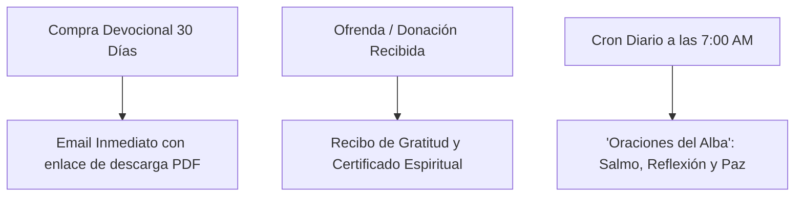

# 📬 05. Integración de Resend y Email Devocional

> [!NOTE]
> El SDK oficial de Resend (`resend: ^6.28.1`) ya está integrado en el proyecto. Este documento define el sistema de despacho de correos electrónicos transaccionales (entrega inmediata del PDF devocional) y devocionales recurrentes (*Oraciones del Alba* a las 7:00 AM).

---

## 1. Casos de Uso del Motor de Email



---

## 2. Cliente Singleton (`lib/resend.ts`)

```typescript
// lib/resend.ts
import { Resend } from 'resend';

if (!process.env.RESEND_API_KEY) {
  throw new Error('Falta la variable RESEND_API_KEY en el entorno.');
}

export const resend = new Resend(process.env.RESEND_API_KEY);
```

---

## 3. Despacho Automático del Devocional en PDF

Función para invocar desde el webhook de Stripe tras confirmar el pago del libro digital:

```typescript
// lib/emails/enviarDevocional.ts
import { resend } from '@/lib/resend';

export async function enviarDevocionalPDF(email: string, nombre: string) {
  try {
    const data = await resend.emails.send({
      from: 'Cielo Santo <paz@cielosanto.com>',
      to: [email],
      subject: '🕊️ Tu Devocional de 30 Días ya está disponible — Cielo Santo',
      html: `
        <div style="font-family: sans-serif; max-width: 600px; margin: 0 auto; padding: 24px; color: #1e293b; background-color: #fdf8f6; border-radius: 16px;">
          <h2 style="color: #b45309; font-family: serif; font-size: 28px; margin-bottom: 12px;">¡Paz y bien, ${nombre || 'hermano'}!</h2>
          <p style="font-size: 16px; line-height: 1.6;">
            Agradecemos de corazón tu confianza y tu siembra en Cielo Santo. Ya puedes descargar tu copia del <strong>Devocional: 30 Días</strong> para comenzar tu transformación espiritual hoy mismo.
          </p>
          <div style="text-align: center; margin: 32px 0;">
            <a href="https://cielosanto.com/descargas/devocional-30-dias.pdf" 
               style="background-color: #0f172a; color: #ffffff; padding: 14px 28px; text-decoration: none; border-radius: 12px; font-weight: bold; display: inline-block;">
              Descargar Libro Digital (PDF)
            </a>
          </div>
          <p style="font-size: 14px; color: #64748b; line-height: 1.5;">
            Guarda este correo para descargar tu archivo cuando lo desees en tu celular, tablet o computadora.
          </p>
          <hr style="border: none; border-top: 1px solid #fed7aa; margin: 24px 0;" />
          <p style="font-size: 12px; color: #94a3b8; text-align: center;">
            Cielo Santo — Ministerio y Comunidad de Oración
          </p>
        </div>
      `,
    });
    return { success: true, data };
  } catch (error) {
    console.error('Error al enviar email con Resend:', error);
    return { success: false, error };
  }
}
```

---

## 4. Despacho Diario de "Oraciones del Alba" (7:00 AM)

### Endpoint de Cron Job (`app/api/cron/devocional-alba/route.ts`):
```typescript
import { NextResponse } from 'next/server';
import { supabase } from '@/lib/supabase';
import { resend } from '@/lib/resend';

export async function GET(req: Request) {
  // 1. Proteger con secreto de cabecera
  const authHeader = req.headers.get('authorization');
  if (authHeader !== `Bearer ${process.env.CRON_SECRET}`) {
    return NextResponse.json({ error: 'No autorizado' }, { status: 401 });
  }

  // 2. Obtener lista de suscriptores activos
  const { data: suscriptores } = await supabase
    .from('suscriptores')
    .select('email, nombre')
    .eq('activo', true);

  if (!suscriptores || suscriptores.length === 0) {
    return NextResponse.json({ message: 'No hay suscriptores activos' });
  }

  // 3. Obtener el versículo y reflexión del día
  const { data: devocional } = await supabase
    .from('versiculos_diarios')
    .select('*')
    .eq('fecha', new Date().toISOString().split('T')[0])
    .single();

  // 4. Envío masivo optimizado mediante batch de Resend
  console.log(`Enviando Oraciones del Alba a ${suscriptores.length} hermanos...`);
  
  return NextResponse.json({ status: 'Devocionales enviados con éxito' });
}
```

---

## 5. Garantías de Reputación y Antispam
1. **Configuración DKIM, SPF y DMARC**: En el panel de Resend con el dominio verificado `cielosanto.com`.
2. **Baja en 1 Clic**: Cada correo incluye un pie de página con enlace directo para cancelar o pausar el envío sin contraseñas engorrosas, cumpliendo con las políticas de Google y Yahoo.
