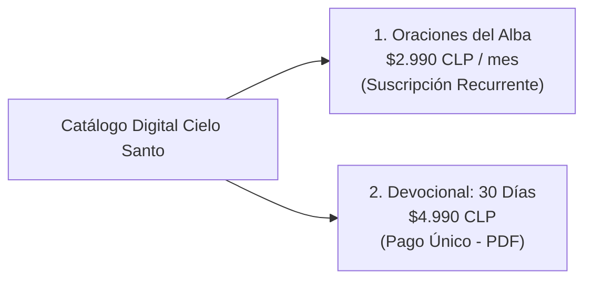
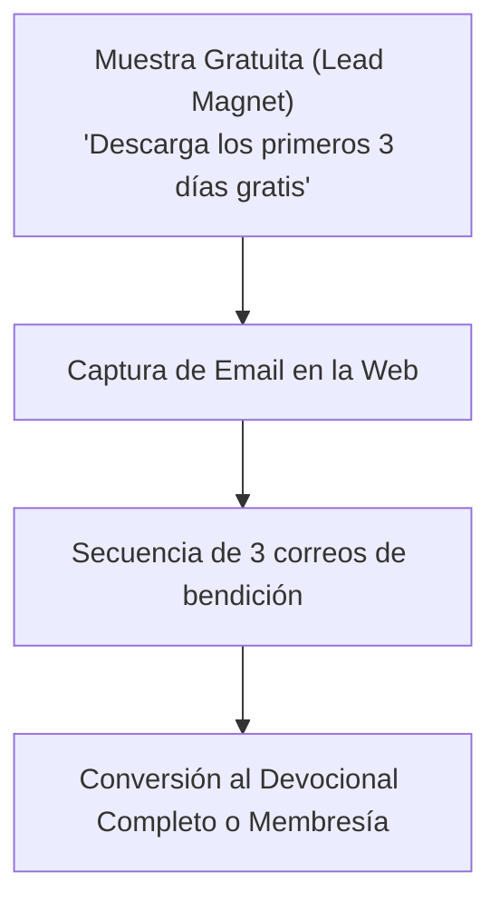

# 📖 01. Catálogo Digital y Devocionales

> [!NOTE]
> El catálogo digital de **Cielo Santo** (`/productos`) combina dos modelos complementarios de monetización de contenido: **ingresos recurrentes predecibles (MRR)** mediante una suscripción de baja fricción y **ventas directas de pago único** mediante un devocional en PDF.

---

## 1. Desglose de la Oferta Actual

### Producto 1: "Oraciones del Alba" (Membresía Devocional)
- **Precio**: **$2.990 CLP / mes** (~$3.15 USD).
- **Formato**: Envío diario al correo a las 7:00 AM.
- **Propuesta de Valor**: *"Empieza cada día con propósito. Recibe inspiración directamente en tu bandeja de entrada antes de que comience el ruido del mundo."*
- **Entregables Concretos**:
  1. Un Salmo y una reflexión profunda diaria redactada con cariño pastoral.
  2. Inclusión del nombre del suscriptor en las oraciones comunitarias semanales que se realizan en los videos de YouTube.
  3. Cancelación en cualquier momento con un solo clic.
- **Economía del Producto**:
  - 500 suscriptores = $1.495.000 CLP/mes (~$1.570 USD/mes).
  - 1.500 suscriptores = $4.485.000 CLP/mes (~$4.720 USD/mes).

### Producto 2: "Devocional: 30 Días" (Libro Digital)
- **Precio**: **$4.990 CLP / único pago** (~$5.25 USD).
- **Formato**: Archivo PDF interactivo descargable al instante.
- **Propuesta de Valor**: *"Una guía completa para transformar tu mentalidad. Diseñada para leerse en 10 minutos al día y encontrar fortaleza en los momentos difíciles."*
- **Entregables Concretos**:
  1. Descarga inmediata a celular, tablet o computadora.
  2. 30 reflexiones guiadas basadas en los Salmos más poderosos de protección y fe.
  3. Tipografía y diagramación optimizada para lectura nocturna o matutina en pantallas pequeñas.
- **Badge de Autoridad**: Destacado con el badge *"MÁS VENDIDO"*.

---

## 2. Palancas Psicológicas de Conversión Utilizadas

1. **Precio Accesible (Micro-Tickets)**: Precios inferiores a 5.000 pesos chilenos reducen drásticamente la barrera de decisión financiera.
2. **Alivio a la Ansiedad Digital**: La promesa de recibir el mensaje *antes* del ruido del mundo conecta con la fatiga informativa moderna.
3. **Sentido de Pertenencia**: *"Inclusión de tu nombre en nuestras oraciones comunitarias"* transforma una compra digital en una comunión espiritual.
4. **Garantía y Transparencia**: Despeje de dudas con los 3 pilares del FAQ (seguridad de tarjeta, descarga inmediata y cancelación fácil).

---

## 3. Oportunidades de Mejora y Expansión

1. **Lead Magnet "Capítulo 1 Gratis"**: Permitir la descarga de los primeros 3 días del devocional a cambio del correo electrónico, nutriendo la base de datos de Resend.
2. **Audio-Devocional (Upsell)**: Ofrecer la versión narrada con música sacra instrumental por $1.990 CLP adicionales al momento del checkout en Stripe.
3. **Versión Regalo**: Opción de *"Regala este devocional a un familiar enfermo o en crisis"*, enviando el PDF con una dedicatoria personalizada.
