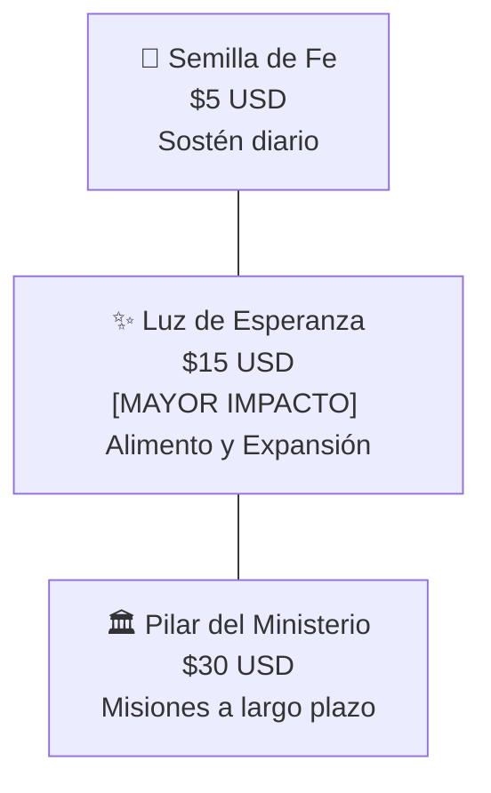

# 🌾 02. Sistema de Donaciones y Siembra

> [!NOTE]
> En la cosmovisión de **Cielo Santo**, la donación no se pide como un tributo ni una obligación, sino como una **siembra voluntaria de amor y solidaridad** donde el donante se convierte en *"la respuesta a la oración de alguien más"*.

---

## 1. La Estructura de los Tres Niveles de Ofrenda

### Tabla Comparativa de Tiers

| Nivel | Aporte | Mensaje Pastoral | Destino Principal de los Fondos |
| :--- | :---: | :--- | :--- |
| **Semilla de Fe** | **$5 USD** | *"Para que nuestra oración siga llegando a miles de hermanos cada mañana."* | Servidores web, hosting y plataformas de distribución de audio. |
| **Luz de Esperanza** | **$15 USD** | *"Apoya la expansión de la congregación y nos permite llevar alimento a familias este mes."* | **50% obra social** (cajas de alimentos) / **50% producción** de video y contenido devocional. |
| **Pilar del Ministerio** | **$30 USD** | *"Sostiene nuestra obra a largo plazo y asegura nuestras misiones en comedores solidarios."* | Misiones continuas con fundaciones aliadas y equipos de grabación profesional. |

---

## 2. Los Dos Brazos de la Obra: Transparencia Concreta

Para erradicar cualquier suspicacia en torno al manejo de fondos religiosos, la página `/donaciones` divide el impacto en dos obras tangibles:

### A. Obra 1: "Pan y Abrigo" (Acción Social Directa)
- **Concepto**: El amor a Dios expresado en ayuda al prójimo vulnerable.
- **Acciones**:
  - Compra y entrega de cajas de despensa con alimentos no perecibles.
  - Raciones de comida caliente en comedores solidarios comunitarios.
  - Ropa y frazadas para familias durante el invierno.
- **Alianza**: Trabajo conjunto con fundaciones locales verificadas.

### B. Obra 2: "Luz y Palabra" (Sostén Espiritual Digital)
- **Concepto**: Mantener la palabra de Dios libre de muros de pago restrictivos.
- **Acciones**:
  - Producción y edición de videos y Shorts diarios en YouTube.
  - Mantenimiento del Muro de Peticiones e infraestructura web.
  - Asegurar que cualquier persona, sin importar su capacidad de pago, pueda orar y recibir consuelo.

---

## 3. Campaña Mensual: "Sembrando Esperanza"

Representada en la Home por el componente interactivo `CampanaDonacion`:
- **Objetivo Concreto del Mes**: *"Mejorar los equipos de audio para las oraciones matutinas y destinar un porcentaje a causas benéficas de nuestra fundación aliada."*
- **Efecto Psicológico**: Al definir una meta específica y delimitada en el tiempo (y no una petición perpetua y ambigua), la comunidad responde con mayor generosidad y compromiso.

---

## 4. Testimonios Testimoniales como Prueba Social
La página `/donaciones` apoya la credibilidad con historias reales:
- **María Fernanda** (Madre de 3 hijos): Recibió una caja de alimentos de la fundación en el momento de mayor desamparo cuando su esposo quedó sin trabajo.
- **Roberto C.** (Miembro de la comunidad): Salpicado por una profunda depresión, encontró alivio en los videos diarios y ahora aporta mensualmente para que la luz nunca se apague.
