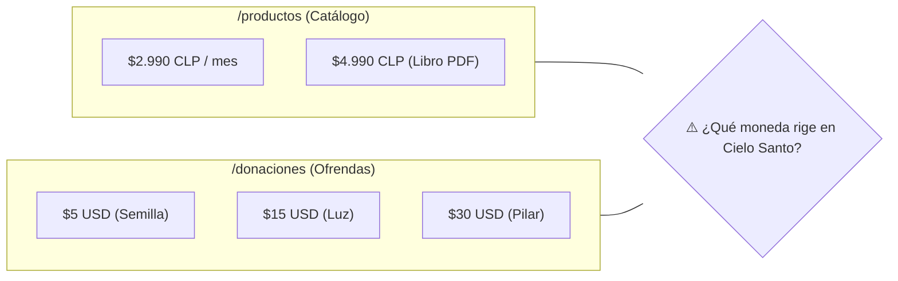

# 💱 03. Estrategia Multidivisa CLP / USD

> [!NOTE]
> Una de las inconsistencias más notorias del proyecto actual es la coexistencia de **Pesos Chilenos (CLP)** en el Catálogo Digital y **Dólares Americanos (USD)** en la página de Donaciones. Este documento analiza las repercusiones de este conflicto y define la hoja de ruta para resolverlo limpiamente.

---

## 1. El Diagnóstico del Conflicto Actual

### Problemas Detectados:
1. **Confusión Numérica Internacional**: Un usuario de México, Colombia o EE.UU. que llega a `/productos` ve `$4.990` y puede interpretar erróneamente que el libro cuesta casi cinco mil dólares.
2. **Fricción de Conversión para Usuarios Chilenos**: Un usuario en Chile que entra a `/donaciones` ve `$15 USD` y debe calcular mentalmente el tipo de cambio (~14.250 CLP), lo que posterga la decisión de aportar.
3. **Complejidad de Stripe**: Si no se configuran precios multidivisa en Stripe, la pasarela rechazará o convertirá cargos con tasas bancarias desfavorables para los donantes.

---

## 2. Las 3 Alternativas Estratégicas

| Alternativa | Descripción | Ventajas | Desventajas |
| :--- | :--- | :--- | :--- |
| **Opción A: Todo en USD** | Homogeneizar toda la web a dólares americanos ($3.50, $5.00, $15.00, $30.00). | Estándar global para toda Latinoamérica y USA. Una sola cuenta bancaria. | Puede parecer más distante para el público chileno tradicional. |
| **Opción B: Toggle Manual (CLP / USD)** | Un interruptor en la cabecera donde el usuario elige ver los precios en CLP o USD. | Control total del usuario, máxima transparencia. | Requiere mantener estados en el cliente y sincronizar dos listas de precios. |
| **Opción C: Stripe Adaptive Pricing (Recomendada)** | Stripe detecta el país de la IP y muestra la moneda local automáticamente en el checkout. | Cero fricción, cobros nativos en moneda local, máxima conversión internacional. | Requiere activar la función en el Dashboard de Stripe. |

---

## 3. Solución Práctica Inmediata (Fase de Transición)

Mientras se conecta la pasarela final de Stripe, se recomienda aplicar una **doble indicación visual transparente** en las tarjetas de la interfaz:

### En `/productos`:
- **Oraciones del Alba**: `$2.990 CLP` ($3.15 USD aprox.)
- **Devocional: 30 Días**: `$4.990 CLP` ($5.25 USD aprox.)

### En `/donaciones`:
- **Semilla de Fe**: `$5 USD` (~$4.700 CLP)
- **Luz de Esperanza**: `$15 USD` (~$14.200 CLP)
- **Pilar del Ministerio**: `$30 USD` (~$28.500 CLP)

### Texto de Confianza en el Footer:
> *"Aceptamos tarjetas de débito y crédito de todos los países. Tu banco realizará la conversión automática a la moneda de tu país sin comisiones ocultas."*
