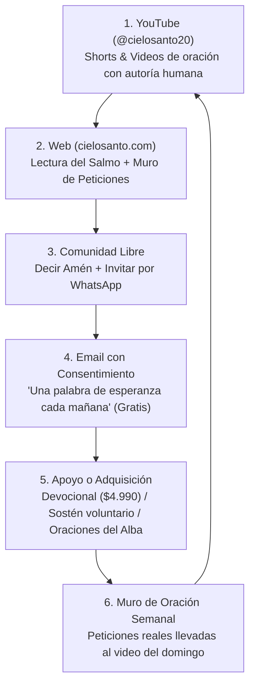

# 🔄 04. Arquitectura Comercial Realista y Flywheel

> [!NOTE]
> Esta nota aterriza el modelo de negocio de **Cielo Santo**, separando con rigor lo que es un **hecho verificado** de lo que es una **hipótesis de trabajo**, y diseñando un ciclo de retroalimentación donde la audiencia de YouTube alimenta la comunidad propia sin depender de falsas promesas espirituales ni de la arbitrariedad de un solo algoritmo.

---

## 1. El Circuito Flywheel de Cielo Santo

A diferencia de un embudo unidireccional que busca extraer una transacción y termina, Cielo Santo opera como un **volante de inercia (flywheel)**:

---

## 2. Las 5 Vías de Ingresos Proyectadas

El proyecto no depende de una sola fuente; combina ingresos de contenido con ingresos de activos propios:

| Vía | Canal | Descripción | Control del Cliente |
| :--- | :--- | :--- | :---: |
| **1. YouTube Monetización** | YouTube Partner Program | Anuncios, Super Thanks, Membresías del canal y Super Chat (Chile es país elegible). | 🔴 Plataforma ajena |
| **2. Producto Digital de Entrada** | Web (Mercado Pago) | *30 días con los Salmos* ($4.990 CLP pago único). Compra de muy baja fricción. | 🟢 Activo propio |
| **3. Suscripción Recurrente** | Web (Mercado Pago) | *Oraciones del Alba Premium* ($2.990 CLP/mes). Reflexión diaria, audio y oración. | 🟢 Activo propio |
| **4. Aportes Voluntarios** | Web (Mercado Pago) | Sostén de la infraestructura de Cielo Santo ($3.000, $10.000, $25.000 o monto libre). | 🟢 Activo propio |
| **5. Campañas Solidarias** | Web / Fundaciones | Fondos con destino exclusivo a alimentación y abrigo infantil (*Pan y Abrigo*). | 🟢 Alianza verificada |

---

## 3. Modelo Matemático Hipotético (Proyección Mensual)

> [!WARNING]
> La siguiente tabla es un **modelo de sensibilidad hipotético**, no una promesa de ingresos. Las variables determinantes son: **Audiencia Real × Confianza Comunitaria × Conversión × Retención (Churn)**.

### Escenario con 10.000 Visitantes Únicos al Mes desde YouTube:

| Métrica del Embudo | Tasa Estimada | Conversiones | Ingreso Unitario | Total Mensual Bruto |
| :--- | :---: | :---: | :---: | :---: |
| **Captura de Email Gratuito** | 3.0% | 300 personas | $0 | Construcción de lista propia |
| **Venta Devocional 30 Días** | 1.0% | 100 ventas | $4.990 CLP | **$499.000 CLP** |
| **Suscripción Oraciones del Alba** | 0.5% | 50 miembros | $2.990 CLP | **$149.500 CLP / mes** (MRR) |
| **Aporte Voluntario Promedio** | 0.5% | 50 aportes | $10.000 CLP | **$500.000 CLP** |
| **Total Estimado Mes 1** | — | — | — | **≈ $1.148.500 CLP** |

*(Más los ingresos que genere AdSense y Super Thanks directamente en YouTube).*

---

## 4. Métricas Clave (KPIs) a Medir desde el Día 1
1. **YouTube → Web CTR**: De cada 1.000 espectadores de YouTube, cuántos hacen clic en el enlace fijado.
2. **Website → Oración**: Qué porcentaje de visitantes interactúa con el Salmo o publica en el Muro.
3. **Website → Email**: Tasa de captura en *"Avisarme cuando oren por mí"* o en el newsletter matutino gratuito.
4. **Email → Retorno**: Qué porcentaje de suscriptores vuelve a la web al recibir el correo matutino.
5. **Retención a 30 Días (% Churn)**: Cuántas personas siguen orando y leyendo tras 4 semanas (el indicador real de comunidad).

---

## 5. El Riesgo de YouTube: Contenido "No Auténtico" de IA
- Las políticas de YouTube sancionan con desmonetización el contenido masivo, repetitivo o generado enteramente con plantillas automatizadas de IA sin intervención humana.
- **La Solución**: Cada video debe incluir **autoría humana real**: reflexión propia, aplicación a una situación cotidiana del hogar y lectura sincera de las peticiones del muro.
