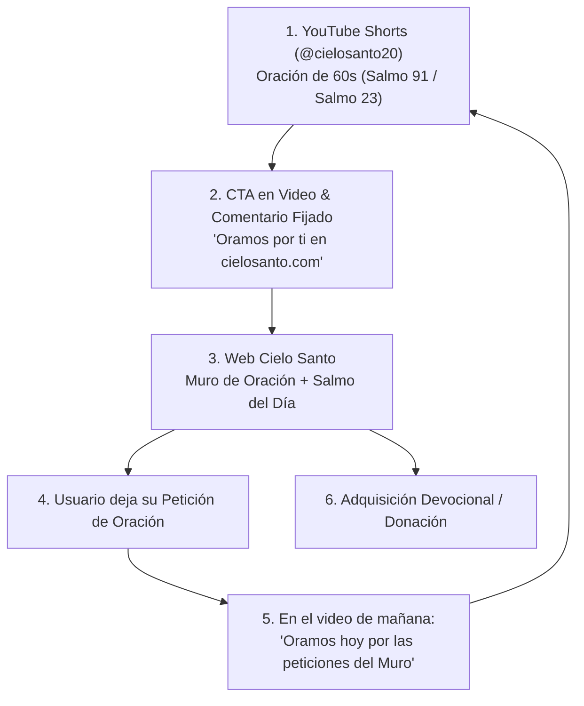

# 🎥 01. Embudo de YouTube Shorts a Comunidad Web

> [!NOTE]
> El canal de YouTube [**@cielosanto20**](https://youtube.com/@cielosanto20) es el motor de tracción y captación orgánica más potente del proyecto. Esta nota describe cómo conectar la audiencia masiva de los videos con la plataforma web a través de un ciclo virtuoso de retroalimentación comunitaria.

---

## 1. El Ciclo Virtuoso de Retroalimentación

---

## 2. Anatomía del Embudo en 4 Pasos

### Paso 1: Atracción Masiva (TOFU - YouTube Shorts)
- **Formato**: Videos verticales de 45 a 60 segundos con fondo en movimiento (naturaleza, cielo, velas encendidas) y subtítulos dinámicos de alto contraste.
- **Contenido**: Oración matutina guiada, decreto de bendición o lectura del Salmo del Día.
- **Punto Clave**: El algoritmo de YouTube premia la retención y los comentarios (personas escribiendo *"Amén"* en el chat).

### Paso 2: El Puente hacia la Web (Comentario Fijado y Bio)
- **Llamado a la Acción (CTA)**:
  > *"¿Necesitas que oremos por una situación difícil en tu familia? Entra ahora a nuestro Muro de Oraciones en cielosanto.com y deja tu petición. Todos los días oramos juntos por los nombres allí anotados."*
- **Enlace de Bio**: Configurar enlace directo con parámetros UTM para medir conversiones (`cielosanto.com?utm_source=youtube&utm_medium=shorts`).

### Paso 3: Retención y Participación en la Web (MOFU)
- Al llegar al sitio web, el visitante no se topa con un muro de pago, sino con un santuario acogedor:
  1. Presiona el botón *"🙏 Decir Amén"* en el Salmo del Día.
  2. Comparte la bendición con sus seres queridos mediante el botón de WhatsApp.
  3. Escribe el nombre de su ser querido y su intención en el **Muro de Intenciones**.

### Paso 4: Monetización y Alianza Solidaria (BOFU)
- Una vez establecida la confianza y el alivio emocional:
  - Quien desea disciplina diaria se suscribe a **Oraciones del Alba** ($2.990 CLP / mes).
  - Quien busca una guía profunda adquiere el **Devocional: 30 Días** ($4.990 CLP).
  - Quien siente gratitud en su corazón ofrenda a la campaña **Sembrando Esperanza**.

---

## 3. La Estrategia de Mención en Video (El Secreto de la Confianza)

El factor decisivo para que este embudo sea imparable es **cerrar el círculo en los videos**:
> *"Hoy queremos poner en las manos del Señor a María Elena, que nos escribió en el Muro de Cielo Santo pidiendo por la salud de su esposo; y a Juan, orando por paz en su hogar. Hermanos, unámonos todos en oración por ellos..."*

Cuando la audiencia ve que las oraciones de la web **son reales y son leídas**, la tasa de rebote cae a cero y el tráfico recurrente se multiplica orgánicamente.
