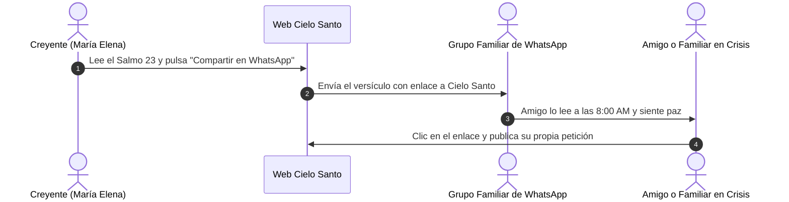

# 💬 02. Motor de WhatsApp y Viralidad Familiar

> [!NOTE]
> En la cultura hispanoamericana, el saludo matutino por WhatsApp con un versículo bíblico o una imagen de bendición es un hábito diario profundamente arraigado en millones de hogares. **Cielo Santo** aprovecha este comportamiento natural para generar viralidad sin costo publicitario.

---

## 1. El Hábito Cultural de la "Bendición Matutina"



---

## 2. Optimización del Mensaje Compartido

### Código Actual en `app/page.tsx` (Línea 99):
```typescript
href={`https://api.whatsapp.com/send?text=${encodeURIComponent('"El Señor es mi pastor; nada me faltará. En lugares de delicados pastos me hará descansar." - Salmo 23:1-2. Compartido desde Cielo Santo.')}`}
```

### Oportunidad de Mejora Crítica:
El mensaje actual no incluye el enlace web directo con hipervínculo clicable.

### Mensaje Optimizado Recomendado:
```typescript
const mensajeWhatsApp = `🕊️ *"El Señor es mi pastor; nada me faltará. En lugares de delicados pastos me hará descansar."* — Salmo 23:1-2.

Que la paz de Dios guarde hoy tu corazón y tu familia. 
🙏 Únete a nuestra oración diaria o deja tu petición aquí:
https://cielosanto.com`;

const urlCompartir = `https://api.whatsapp.com/send?text=${encodeURIComponent(mensajeWhatsApp)}`;
```

---

## 3. Nuevos Puntos de Contacto Viral Proyectados

### A. Botón "Pedir Apoyo" en el Muro de Peticiones
Permitir que quien publique una petición pueda compartirla directamente con sus conocidos:
> *"Hermanos, publiqué una petición de salud por mi madre en Cielo Santo. Les pido que se unan con un Amén y su oración aquí: https://cielosanto.com/oracion/123"*

### B. Canal Oficial de Difusión de WhatsApp (WhatsApp Channels)
- Los Canales de WhatsApp ofrecen tasas de apertura superiores al 90%.
- Publicar a las 6:30 AM el Salmo del Día y el enlace al video de YouTube matutino.
- Integrar un banner en el footer de la web: *"Únete a nuestro Canal de WhatsApp para recibir el Salmo cada amanecer"*.
