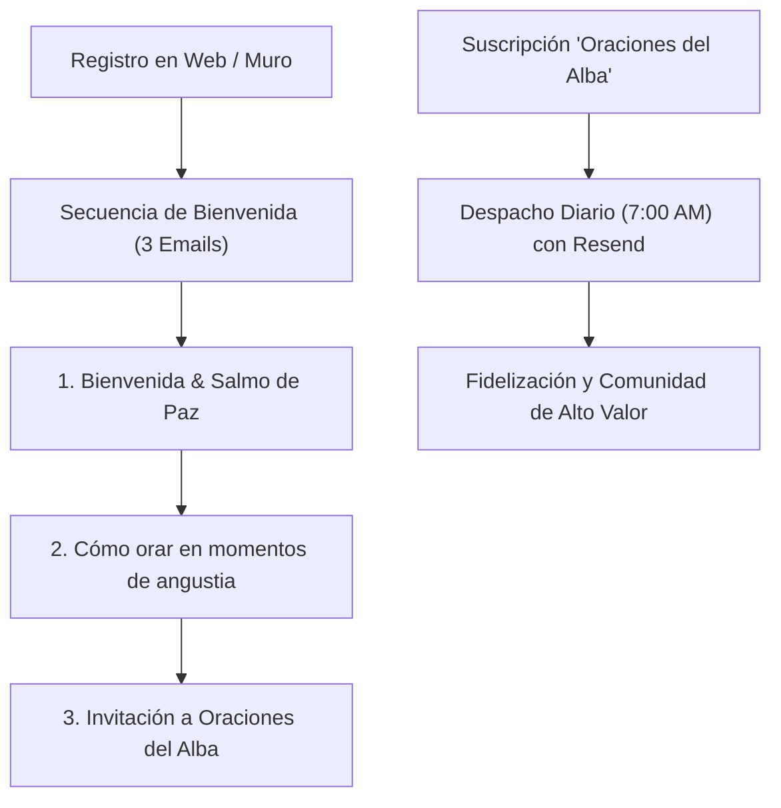

# 💌 03. Retención y Email Marketing Devocional

> [!NOTE]
> En una comunidad de fe, el correo electrónico no es una herramienta de ventas agresiva; es una **carta pastoral íntima** que llega al despertar del creyente para infundir calma antes del estrés de la jornada.

---

## 1. Mapa de las Secuencias Automatizadas de Correo



---

## 2. Secuencia de Bienvenida para Nuevos Miembros

### Email 1: El Refugio de Paz (Inmediato)
- **Asunto**: 🕊️ *Bienvenido a Cielo Santo: Tu refugio de paz comienza hoy*
- **Objetivo**: Validar al usuario, agradecer su confianza y entregar un recurso gratuito (fondo de pantalla para celular con el Salmo 91).
- **Llamado a la acción**: *"Responde a este correo contándome por qué motivo te gustaría que oremos esta semana"*. Esto genera altísima entregabilidad en Gmail y Outlook al incentivar respuestas humanas.

### Email 2: La Fuerza de la Oración Continua (Día 2)
- **Asunto**: 🌿 *Cuando las palabras no alcanzan para orar...*
- **Objetivo**: Enseñar una técnica sencilla de meditación bíblica basada en los Salmos. Demuestra empatía y valor sin pedir nada a cambio.

### Email 3: La Semilla de la Mañana (Día 4)
- **Asunto**: ☀️ *Empieza cada día antes de que comience el ruido*
- **Objetivo**: Presentar la membresía **Oraciones del Alba** ($2.990 CLP / mes) como una disciplina de paz para la mente y el corazón.

---

## 3. Estructura del Email Diario: "Oraciones del Alba" (7:00 AM)

Para maximizar la lectura y evitar la fatiga del suscriptor, cada entrega diaria sigue una estructura fija de 3 minutos de lectura:

```
┌────────────────────────────────────────────────────────┐
│  🕊️ CIELO SANTO — ORACIONES DEL ALBA                   │
├────────────────────────────────────────────────────────┤
│  1. VERSÍCULO DEL DÍA (Salmo o Proverbio destacado)    │
│     "Cercano está el Señor a los quebrantados de       │
│      corazón..." — Salmo 34:18                         │
├────────────────────────────────────────────────────────┤
│  2. LA REFLEXIÓN PASTORAL (2 párrafos cálidos)         │
│     Una enseñanza práctica sobre cómo soltar el miedo  │
│     y caminar con confianza hoy.                       │
├────────────────────────────────────────────────────────┤
│  3. LA ORACIÓN GUIADA (1 párrafo en primera persona)   │
│     "Señor, en tus manos pongo mis cargas..."          │
├────────────────────────────────────────────────────────┤
│  4. INTENCIONES DE LA COMUNIDAD                        │
│     "Hoy oramos especialmente por la salud de los      │
│      enfermos y la provisión de quienes buscan empleo" │
├────────────────────────────────────────────────────────┤
│  Pie de página: Cancelar o pausar con un solo clic.     │
└────────────────────────────────────────────────────────┘
```

---

## 4. Métricas Clave de Salud del Canal
- **Tasa de Apertura (Open Rate)**: Objetivo > 45% (las comunidades devocionales suelen duplicar el promedio de la industria).
- **Tasa de Clics (CTR)**: Objetivo > 5%.
- **Tasa de Desuscripción (Churn)**: Objetivo < 1% mensual.
