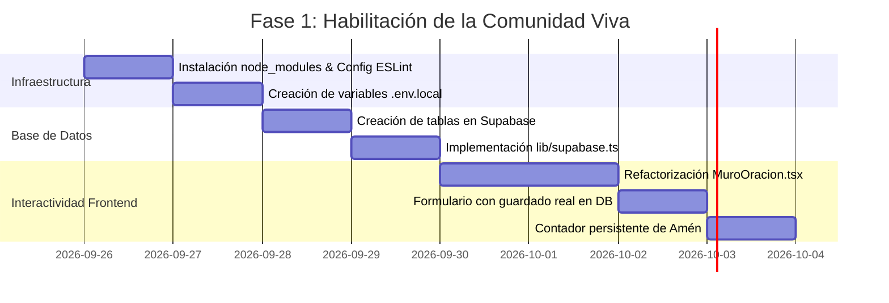

# 🚀 01. Fase 1: Conexión Funcional y Persistencia en DB

> [!NOTE]
> **Objetivo de la Fase 1**: Convertir la maqueta visual de Cielo Santo en una plataforma viva donde las oraciones se guarden de verdad, el contador de Amén sea compartido por toda la comunidad y el visitante reciba feedback inmediato.

---

## 1. Alcance y Entregables de la Fase 1

---

## 2. Tareas Detalladas de Ejecución

### Tarea 1.1: Puesta a Punto del Entorno Local
- [ ] Ejecutar `npm install` para resolver `eslint-config-next` y dependencias de React 19.
- [ ] Validar compilación limpia mediante `npm run build`.
- [ ] Configurar `next.config.ts` para habilitar `images.unsplash.com`.

### Tarea 1.2: Inicialización de Supabase
- [ ] Crear proyecto en [Supabase.com](https://supabase.com).
- [ ] Correr el script DDL de [[03_Integracion_Supabase_Base_de_Datos]] para generar las tablas `peticiones` y `versiculos_diarios`.
- [ ] Crear el cliente singleton `lib/supabase.ts`.

### Tarea 1.3: Activación del Muro de Peticiones
- [ ] Modificar el formulario en `app/page.tsx` (o extraer a `components/MuroOracion.tsx`).
- [ ] Crear endpoint `POST /api/peticiones` con sanitización básica de texto.
- [ ] Mostrar estado de carga (*"Registrando tu petición..."*) y mensaje de confirmación cálido tras el envío:
  > *"¡Paz sea contigo! Tu petición ha sido registrada. La comunidad y nuestro equipo estarán orando por ti."*
- [ ] Conectar el botón *"Unirme en Oración"* a la función RPC `incrementar_apoyo`.

### Tarea 1.4: Contador Colectivo de "Amén"
- [ ] Conectar el botón *"Decir Amén"* del Salmo del Día a la tabla `versiculos_diarios`.
- [ ] Guardar en `localStorage` la fecha del último amén del usuario para evitar clics repetitivos dentro del mismo día.
- [ ] Optimizar el enlace de WhatsApp para incluir la URL oficial `https://cielosanto.com`.

---

## 3. Criterios de Éxito de la Fase 1
1. Un visitante publica una petición y esta aparece visible inmediatamente en el muro.
2. Al recargar la página (`F5`), las peticiones siguen presentes y ordenadas por fecha.
3. El botón de Amén incrementa un número global en la base de datos visible para todos los usuarios.
