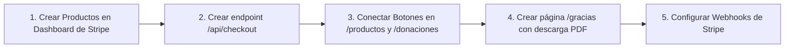

# 💳 02. Fase 2: Pasarela Stripe Operativa

> [!NOTE]
> **Objetivo de la Fase 2**: Eliminar los botones desconectados en el Catálogo Digital (`/productos`) y en la página de Ofrendas (`/donaciones`), habilitando transacciones bancarias seguras con Stripe Checkout y entrega digital inmediata.

---

## 1. Alcance y Entregables de la Fase 2



---

## 2. Tareas Detalladas de Ejecución

### Tarea 2.1: Configuración de Productos en Stripe Dashboard
- [ ] Crear Producto de Suscripción: **"Oraciones del Alba"** (Cobro mensual recurrente).
- [ ] Crear Producto de Pago Único: **"Devocional: 30 Días"** (Cobro único).
- [ ] Crear Precios de Donación: Tiers de **$5 USD**, **$15 USD** y **$30 USD** (con opción de donación única o mensual).
- [ ] Anotar los `price_id` generados y guardarlos en `.env.local`.

### Tarea 2.2: Implementación del Endpoint de Checkout
- [ ] Crear `lib/stripe.ts` con la clave secreta.
- [ ] Implementar `app/api/checkout/route.ts` con soporte para parámetros:
  - `priceId`: Identificador del producto.
  - `mode`: `'subscription'` o `'payment'`.
  - `successUrlPath`: Destino tras el pago completado.

### Tarea 2.3: Conexión de Botones en la Interfaz
- [ ] En `/productos`:
  - Botón *"Suscribirme Ahora"*: Llama a `/api/checkout` con el ID de *Oraciones del Alba*.
  - Botón *"Comprar y Descargar"*: Llama a `/api/checkout` con el ID del *Devocional 30 Días*.
- [ ] En `/donaciones`:
  - Los tres botones *"Ofrendar Ahora"*: Conectados a sus respectivos montos en Stripe.
  - Añadir estados de carga (*"Conectando con la pasarela segura..."*).

### Tarea 2.4: Página de Confirmación (`app/gracias/page.tsx`)
- [ ] Crear una página acogedora y bendecida para recibir al usuario post-compra.
- [ ] Si adquirió el Devocional, mostrar un botón prominente: **"📥 Descargar mi Devocional en PDF Ahora"**.
- [ ] Mensaje pastoral de gratitud y confirmación de que se le envió una copia al correo.

### Tarea 2.5: Receptor de Webhooks de Stripe
- [ ] Configurar endpoint `POST /api/webhooks/stripe`.
- [ ] Probar localmente eventos con el CLI de Stripe:
  ```bash
  stripe listen --forward-to localhost:3000/api/webhooks/stripe
  ```

---

## 3. Criterios de Éxito de la Fase 2
1. Un usuario hace clic en *"Comprar y Descargar"*, ingresa su tarjeta en Stripe (modo prueba o real) y es redirigido a `/gracias`.
2. Puede descargar inmediatamente su archivo PDF del devocional.
3. El webhook registra la transacción en la tabla `donaciones` o `suscriptores` de Supabase.
