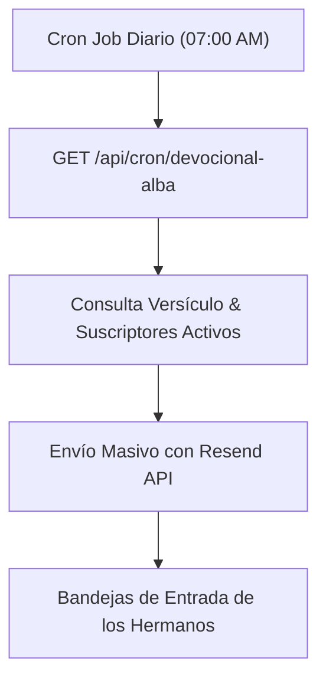

# 🕊️ 03. Fase 3: Automatización y Escala Comunitaria

> [!NOTE]
> **Objetivo de la Fase 3**: Poner en piloto automático el cumplimiento de la promesa central de Cielo Santo: el envío matutino de devocionales a las 7:00 AM con Resend, y consolidar la sinergia audiovisual con el canal de YouTube `@cielosanto20`.

---

## 1. Alcance y Entregables de la Fase 3



---

## 2. Tareas Detalladas de Ejecución

### Tarea 3.1: Configuración del Dominio en Resend
- [ ] Configurar registros DNS (DKIM, SPF y DMARC) en el registrador de dominio para `cielosanto.com`.
- [ ] Validar reputación de remitente para evitar filtros de spam.
- [ ] Implementar plantilla responsive con React Email o HTML limpio.

### Tarea 3.2: Cron Job Programado
- [ ] Configurar `vercel.json` con la directiva de cron:
  ```json
  {
    "crons": [
      {
        "path": "/api/cron/devocional-alba",
        "schedule": "0 10 * * *"
      }
    ]
  }
  ```
  *(Nota: 10:00 AM UTC equivale a las 7:00 AM en Chile/Argentina).*
- [ ] Proteger el endpoint con `CRON_SECRET` en los encabezados HTTP.

### Tarea 3.3: Panel de Moderación Básica de Peticiones
- [ ] Implementar filtro de palabras prohibidas o moderación con IA para descartar spam publicitario en el Muro de Oraciones.
- [ ] Enlace directo al editor de tablas de Supabase para archivar o destacar intenciones especiales.

### Tarea 3.4: Sinergia Audiovisual y Reproductor Real
- [ ] Reemplazar la miniatura estática en `/donaciones` por un reproductor real de YouTube embebido o un modal lightbox accesible.
- [ ] Agregar carrusel o feed de los últimos 3 Shorts de `@cielosanto20` en la página principal.

---

## 3. Criterios de Éxito de la Fase 3
1. A las 7:00 AM de cada mañana, los suscriptores reciben sin fallos el Salmo y la reflexión del día.
2. La tasa de rebote o spam se mantiene por debajo del 0.2%.
3. El canal de YouTube y la web retroalimentan mutuamente sus audiencias.
