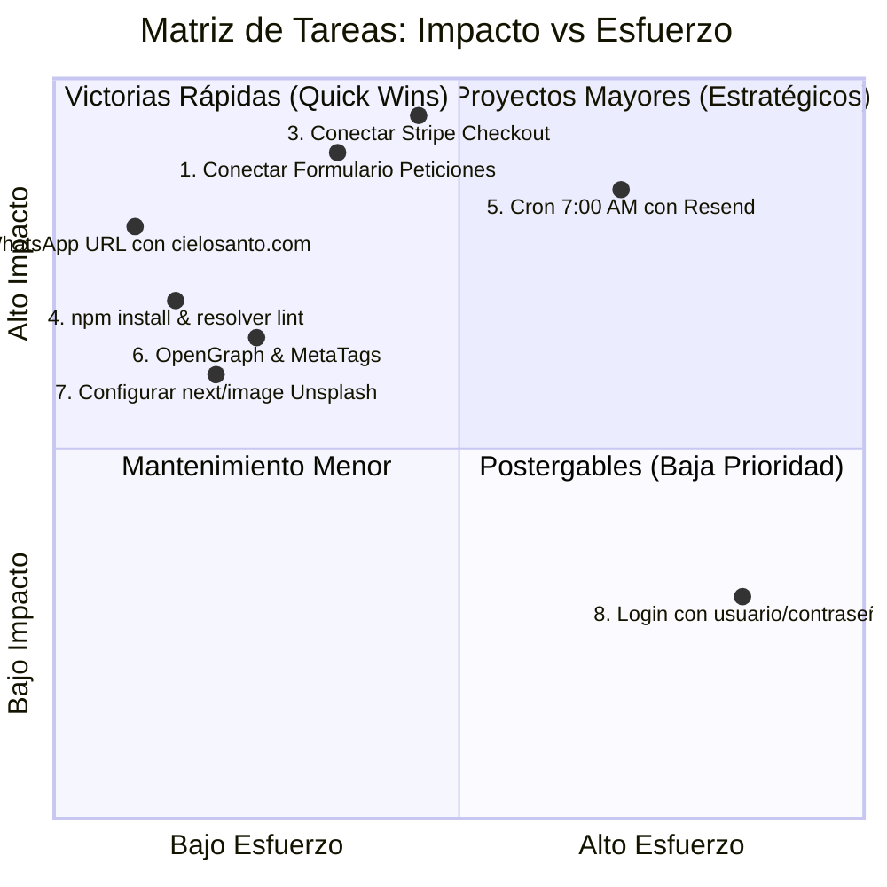

# 📋 04. Backlog Técnico Priorizado

> [!NOTE]
> Este documento organiza todas las tareas pendientes del proyecto mediante una matriz de **Impacto vs. Esfuerzo**, permitiendo al equipo saber con exactitud qué programar primero para maximizar el valor con el menor tiempo de desarrollo.

---

## 1. Matriz de Priorización (Impacto vs. Esfuerzo)

---

## 2. Listado Maestro de Tareas Priorizadas

### 🔥 Nivel 1: Victorias Rápidas (Inmediatas / 1-2 horas)
- [ ] **T-01: Instalar dependencias en el repositorio local**: Ejecutar `npm install` para que ESLint y TypeScript compilen sin quejas.
- [ ] **T-02: Agregar URL clicable al botón de WhatsApp**: Modificar el mensaje en `app/page.tsx` para que incluya `https://cielosanto.com`.
- [ ] **T-03: Crear archivo `.env.local`**: Configurar claves de Supabase, Stripe y Resend basadas en [[01_Variables_de_Entorno_Template]].
- [ ] **T-04: Habilitar dominio de Unsplash en `next.config.ts`**: Permitir imágenes externas para optimización automática.

---

### ⚡ Nivel 2: Proyectos de Alto Impacto (Fase 1 y 2 / 1-2 días)
- [ ] **T-05: Conexión persistente del Muro de Oraciones con Supabase**:
  - Crear tabla `peticiones` con RLS.
  - Implementar endpoint `POST /api/peticiones` y `GET /api/peticiones`.
  - Conectar el formulario para guardar oraciones y mostrar confirmación.
- [ ] **T-06: Contador persistente de "Decir Amén"**:
  - Incrementar en Supabase y persistir el estado diario en el cliente.
- [ ] **T-07: Conectar Pasarela de Stripe para Productos**:
  - Implementar `/api/checkout` para *Oraciones del Alba* y *Devocional 30 Días*.
  - Crear página `app/gracias/page.tsx` con descarga inmediata.
- [ ] **T-08: Conectar Botones de Ofrenda en `/donaciones`**:
  - Habilitar cobro de los 3 tiers ($5, $15, $30 USD).

---

### 🛠️ Nivel 3: Calidad y Automatización (Fase 3 / 2-3 días)
- [ ] **T-09: Despacho automático de devocionales con Resend**:
  - Configurar cron a las 7:00 AM en Vercel.
  - Diseñar template HTML responsivo.
- [ ] **T-10: Optimización SEO y OpenGraph**:
  - Diseñar banner de previsualización `og-image.jpg` (1200x630px).
  - Configurar metadatos en `layout.tsx`, `productos/page.tsx` y `donaciones/page.tsx`.
- [ ] **T-11: Menú móvil responsive y active link en Navbar**:
  - Corregir el doble resaltado de enlaces en la barra de navegación.

---

### ⏳ Nivel 4: Mejoras Futuras y Escala (Post-lanzamiento)
- [ ] **T-12: Sistema de audio-oraciones**: Subir versión en audio con música sacra para escuchar en streaming desde la web.
- [ ] **T-13: Canal de Difusión en WhatsApp**: Enlace directo en el footer para suscripción sin fricción.
- [ ] **T-14: Panel de Moderación de Intenciones con Inteligencia Artificial**: Filtrar automáticamente solicitudes que no sean de oración.
